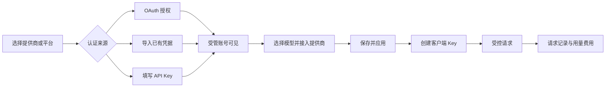

# Prism 功能重构设计：以 CPA 日常使用为中心

2026-09-11。状态：完成对照后的产品与实现方案，尚未实施。依据为用户最新要求和[当前功能审查](../reports/prism-cpamp-functional-audit-20260911.md)，不是新的视觉提案。

## 产品目标与本轮决策

用户安装 CPAR 后，应在浏览器中完成账号接入、提供商配置、模型开放、Key 分发和问题定位，无需理解配置版本、revision、EndpointCredentialBinding 或 Candidate 这些实现对象。

保留 Apple Liquid Glass 视觉偏好。后续 OpenDesign 按这里的真实操作与状态做界面，不再先画总览再用已有接口凑栏目。如需外部设计模型，继续使用用户已指定的 OpenDesign → Pi → Kimi for Coding K3，max；本次只做功能取证与流程设计，没有重新调用模型生成美化图。

本轮用户已否定固定 14 个一级栏目的安排，所以下列八个一级入口作为新的建议基线。后台配置快照、审计、保留历史数据等正确性机制继续存在。没有任何生产数据清理需求。

## 一级导航与完整旧入口归属

| 新一级入口 | 默认内容和主要动作 | 当前栏目去向 |
|---|---|---|
| 仪表盘 | 请求／可用账号／费用／待处理问题；接入账号、配置提供商和创建 Key 的快捷动作 | 总览 |
| 账号管理 | 受管账号列表、授权登录、导入凭证、额度与健康、单项／批量维护 | 账号池＋凭据详情＋账号相关运行诊断 |
| AI 提供商 | 服务商类型、地址、凭据来源、模型、代理、优先级；添加、编辑、启停、测试 | 上游＋端点／绑定子资源＋提供商出口配置 |
| 模型管理 | 上游模型、对外模型／别名、当前可用性、Key 上下文；高级路由 | 模型目录＋模型与路由 |
| API 密钥 | 名称、模型范围、有效期、启停／撤销、使用记录；高级访问组 | 访问控制 |
| 请求日志 | 请求列表、失败原因、单次重试链和关联账号；服务日志单独子页 | 请求与失败＋运行诊断中与请求关联的部分 |
| 用量与费用 | 时间范围与分组统计、Token、费用、计价状态；价格、账本子页 | 用量分析＋计费与价格 |
| 设置 | 网关参数、默认代理、管理员、外观、系统信息；高级维护 | 设置＋出口策略＋配置版本／审计备份／剩余运行诊断 |

账号管理顶部固定提供“添加账号”，下拉或分步选择“授权登录／导入凭证／API Key”。授权是直达主操作，不埋在账号详情深处。CPAMP 的独立 OAuth 工作区在 CPAR 合并到这里，仍支持直接链接及提供商页面的“授权账号”跳转。

旧 `#/` 继续作为仪表盘。旧 `#/accounts` 继续可用；`#/catalog`、`#/models`、`#/billing`、`#/usage`、`#/runtime`、`#/versions`、`#/audit`、`#/egress` 等在实现时映射到对应子页，保留已有 query 和深链语义。取消一级入口不等于删路由或删数据。最终路由变更须有明确映射测试。

## 账号管理：页面和交互

**顶部动作：** 添加账号、导入凭证、刷新。刷新列表只读取网关，主动查询上游额度是单独操作。

**筛选：** 平台／服务商、认证状态、启停状态、额度风险、关键词。关键词查名称、已脱敏账号信息与备注。采用服务端分页与搜索，不把“当前已加载”误当所有账号。

**列表：** 一行代表一个受管凭据身份；同一账号的多个端点绑定放在可展开的“使用位置”中。只有服务器确认的同一凭据身份才能归组，不能按邮箱、名称或短编号去重。未绑定、授权中、授权失败、禁用账号也必须能看到。

**主要信息：** 账号名称、平台、认证状态、额度窗口与更新时间、最近请求、所属提供商和用途。认证、额度、权益、启停与运行健康分别呈现；未观测保持未知，套餐不推导模型白名单。

**单行操作：** 重新授权、启用／停用、编辑资料、关联提供商、查看模型、请求记录；额度刷新依实际能力提供。删除放进更多操作，先显示依赖与影响；不能级联清空历史。

**批量操作：** 启用、停用、设置优先级、删除预览。按稳定身份提交有界集合，逐项返回成功／失败／冲突，部分失败能选择性重试，不自动重放冲突写请求。

**详情：** 概览、额度、模型、使用位置、请求与诊断。技术 ID 与原始接口事实按需展开；普通用户不需要进入第二层“凭据”面板才能重新授权。进入、切换和关闭详情保持正确焦点。

### 新增 OAuth 账号

1. 在账号管理选择“添加账号 → 授权登录”。
2. 选择实际可用平台；页面根据服务端能力给出浏览器授权或设备授权，不能把所有平台接到 Codex。
3. 后端建立临时授权会话，不要求用户填写 `kind`、凭据 ID 或伪造非空 secret。
4. 用户在真实服务商页面授权；远程部署保留粘贴完整回调地址的恢复路径。设备流显示对应 verification URI／user code／有效期。
5. 交换完成后凭据加密落库、metadata 安全投影、账号立即出现在列表；取消／过期／失败不会留下不可发现的半成品。
6. 展示“账号已添加”和“是否已接入服务”两个事实。可继续选择提供商、模型和访问范围，再保存并应用。

重新授权从原账号直接启动，保持其关联和历史身份；不得让旧状态覆盖较新的授权结果。刷新 token 与首次登录分开。实际管理端当前接好的是 Codex；Grok/Kiro 等已有实现的管理端接线逐一核对，其他 CPA 平台要先补后端能力，不能靠前端按钮宣称支持。

### 导入已有账号

1. 上传文件或粘贴 JSON，选择／识别支持的格式。
2. 服务端进行有界解析，复用现有 CPA/Sub2API 解析器，返回脱敏预览：平台、账号、重复项、错误项和目标提供商。
3. 明确选择新增或更新；不能仅用邮箱判重。批量限制、文件大小、重复提交和失败重试行为写入契约。
4. 提交后逐项报告结果；未绑定账号仍在完整列表中，能继续接入或移除。

不把整个多账号导出塞进一个 CredentialInput，也不把凭据 JSON 写入浏览器持久存储。秘密导出仍不属于此次用户已请求的功能范围；CPAMP 的下载入口记录为差异，不直接搬入。

## AI 提供商、模型和 Key：完成一次接入

提供商表单按后端支持的类型呈现常用字段：名称、API 地址、认证来源、模型和默认代理。API Key、已授权账号和已导入账号是三种认证来源。`kind/adapter_id/inference_path` 的正确默认值由服务端能力／受测试的类型映射决定。

已有提供商直接编辑；新增提供商由单个向导生成必要的 Upstream／Endpoint／CredentialBinding，而不是用户逐项新建。高级参数折叠。连接测试、模型发现、推理试用区分展示，只有主动点击对应操作才触发网络调用。

模型工作区以对外 exact model ID 为中心，展示真实上游来源、别名、启停、可用性与授权上下文。普通接入可自动生成单条默认路由和候选，复杂优先级、故障转移与条件放入高级路由。目录中存在不等于当前 Key 可调用，模型规则不能根据套餐名称猜测。

API 密钥页面使用用户语言：名称、允许模型、有效期、状态与使用记录。普通用户可以使用自动生成的专属访问组，复杂组复用放到高级设置。只在创建时交付 secret；管理登录密码、提供商凭据和客户端 Key 保持明确区分。

核心任务链：

## 保存与应用：隐藏实现复杂度，保留正确性

普通配置表单统一显示“保存并应用”。用户不需要创建版本、输入 revision 或跨页发布。

现有创建版本接口只创建空图，不能直接用作“编辑当前配置”的内部克隆。需要后端提供基于当前有效配置的受保护变更工作流：保留无关资源与授权，处理版本绑定的秘密重新封装，校验后原子生效，成功后前端重读当前状态。

应用过程必须覆盖：当前 active 已变化、同一对象被其他会话修改、后台 OAuth 刚完成轮换、校验失败、进程中断和重复提交。不能让新配置的旧凭据覆盖后台最新 token；冲突时保留用户输入并显示可重读的差异，禁止静默重试发布。

审计和内部版本自动产生；设置 → 高级 → 变更记录可查看和恢复上一份可用配置。具体资源的记录从其详情进入。此前用户要求保留的请求、账本和凭据关联不随栏目合并改变。

## 仪表盘、请求与费用

仪表盘默认回答：今天处理了多少请求、哪些账号需要处理、调用了哪些模型、费用是多少。进程累计 attempts、checkpoint、内部 revision 等只在诊断中使用。

补齐请求级事实源后再展示成功率、趋势和延迟。之前这些属于明确延期内容；本方案将其纳入 CPAMP 功能对齐阶段，不声称当前已经支持。不能用账本行数与失败行数相加构造请求总数，也不能把一次请求中的多次 attempt 当多次请求。

请求列表统一纳入成功、上游失败、入口拒绝、取消、零 token 和流式中断；缺失数据有明确语义。单次详情关联模型、账号、提供商、Key、attempt、费用和脱敏错误。服务日志是独立子页，不能用审计日志或异常账本替代。

用量与费用共享时间范围及维度筛选，保留六类 token 的置信度和部分计价状态。账本、价格、导入与回滚成为该工作区的子页。已有物化、窄窗查询和历史保留能力复用，不另建一套不一致的计费数据。

设置先明确“可在线修改”“部署参数需重启”“仅当前浏览器”的区别。可写的网关参数须有真实契约；不添加无人处理的开关。在线备份恢复、自动 Provider 巡检、插件运行时与 Autoreg 不因参考 CPAMP 自动纳入本轮。

## 必须补齐的契约包

下列是待定稿要求，不是已经存在的 API。不改动生成客户端或以 fixture 冒充接口。由本轮统一负责前后端的 Codex 完成后端实现与权威 OpenAPI，再 sync-contract 接前端。

| 契约包 | 必须表达的能力 | 当前可复用／限制 |
|---|---|---|
| 完整账号与端点库存 | 受管凭据／端点的完整有界枚举、服务端搜索、稳定分页、绑定与观测的区分 | 有单项 CRUD；运行投影遗漏未绑定对象。沿用旧 CR-FE-001 的库存需求但按当前有界分页纪律定稿 |
| 平台与操作能力 | Provider、认证类型、授权方式、可用操作及具体不可用原因 | 旧 G7 只是提案；当前管理工作流主要是 Codex，不能据此推定其他平台 |
| 账号生命周期 | 初次授权会话、回调／设备流、重授权、导入预览和提交、无需秘密的资料与状态修改 | 复用现有 Codex 交换、存储、加密、CAS、续期与解析器；通用 PATCH 当前要求重填 secret |
| 当前配置变更 | 真正复制或服务端事务应用、变更校验、并发生效、失败恢复和安全凭据转移 | 复用 lifecycle/publish/rollback；parent_id 不是克隆 API |
| 请求与汇总 | 完整请求索引、维度和时间窗聚合、延迟与趋势、分页快照 | 复用持久事件、attempt、failure、usage、billing，不混用其统计粒度 |
| 系统与日志 | 安全的运行信息、可改参数及生效要求、有界脱敏日志 | 当前设置主要是前端偏好，不能直接读服务器文件冒充同源管理 API |

## 实施顺序与退出条件

### 第一批：修复能确定的功能错误

修正 `oauth_json` 类型、授权按钮的真实能力判定和新建凭据默认值；补真实类型 fixtures 与浏览器回归。仅修改 kind 判断并不足以为所有平台开放 OAuth。先完成 Codex 的明确行为，其余平台要显示真实支持状态。

通过条件：真实后端返回的 OAuth 凭据能进入重新授权；API Key 账号按正常表单创建后通过真实运行装配；已有 `bearer/oauth_json` 状态与字段正常呈现。期间不能借“修入口”发起生产 OAuth 或真实推理。

### 第二批：账号与提供商接入闭环

补库存、生命周期和当前配置变更契约；完成账号主页、授权／导入、状态管理与提供商向导。移除主导航中的配置版本、审计备份等内部入口，迁移旧深链。

通过条件：空安装从浏览器添加账号和提供商；授权成功／失败均可找到账号；未绑定账号可恢复管理；停用不重填秘密；修改一个提供商不丢其他配置；多端并发和 OAuth 轮换不被旧变更覆盖。

### 第三批：模型与客户端接入

完成模型目录／路由整合、默认简单接入、高级路由及 API 密钥工作区。

通过条件：普通用户能选择模型、生成 Key、完成 loopback 受控请求；既有复杂路由、候选、别名、访问组与 Explain 可继续维护；模型 exact ID 和历史引用不被改写。

### 第四批：观测与网关设置

实现请求事实源和汇总契约，完成仪表盘、请求日志、用量与费用、系统参数和高级维护组织。

通过条件：请求记录覆盖不计费和零 token 请求；重试不会抬高请求数；窄窗大数据、金额未知、分页一致性和进程重启通过；设置能明确显示真实可写参数及其生效状态。

每批以完整用户任务验收，运行适用的前端、Rust、契约、嵌入门禁与本地真实 gateway 检查；不再用“栏目数量”和旧测试总数代替任务完成。测试使用合成配置、临时状态与 loopback Provider／OAuth transport；真正平台授权、推理和后续生产发布按其实际操作范围执行。

本方案交付时没有开始上述代码修改；下一批应从第一批正确性修复和第二批账号接入闭环着手。
