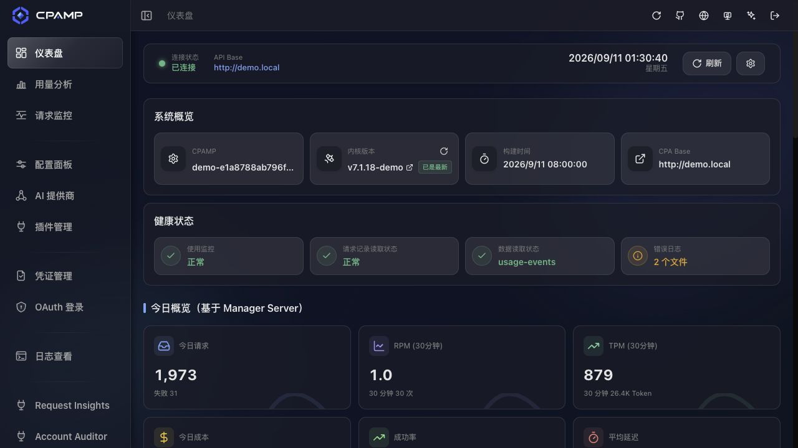
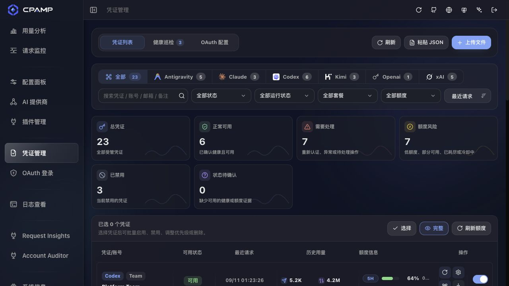
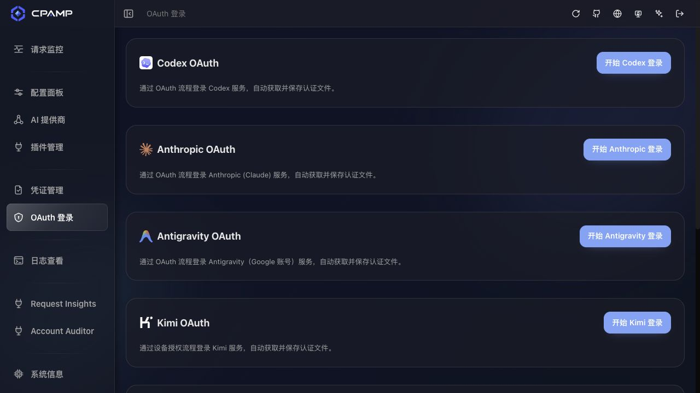
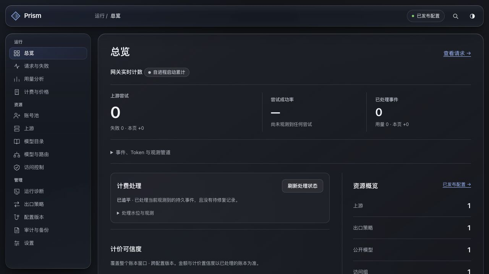
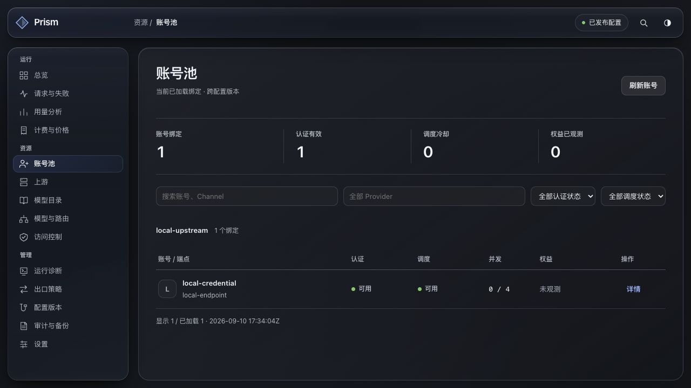
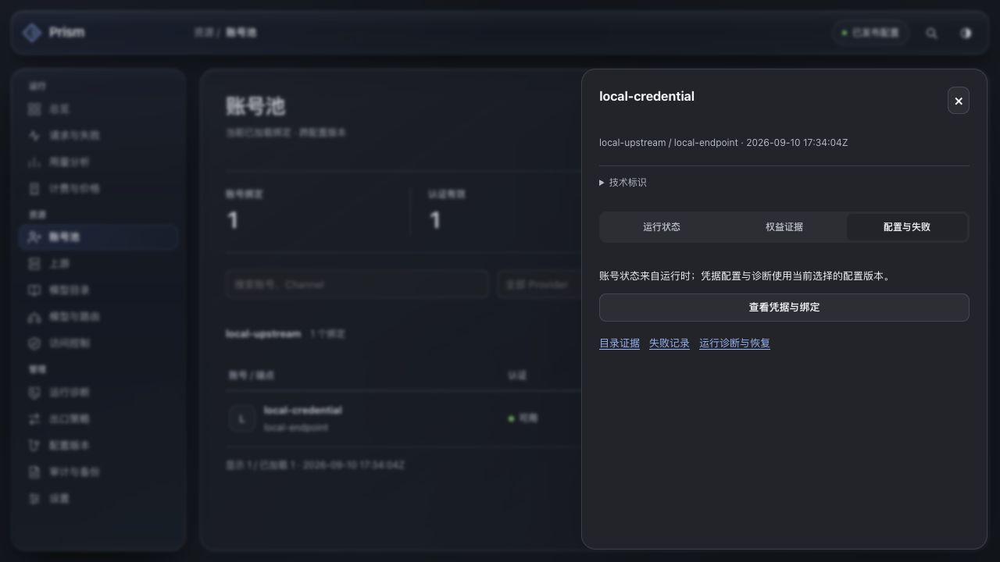
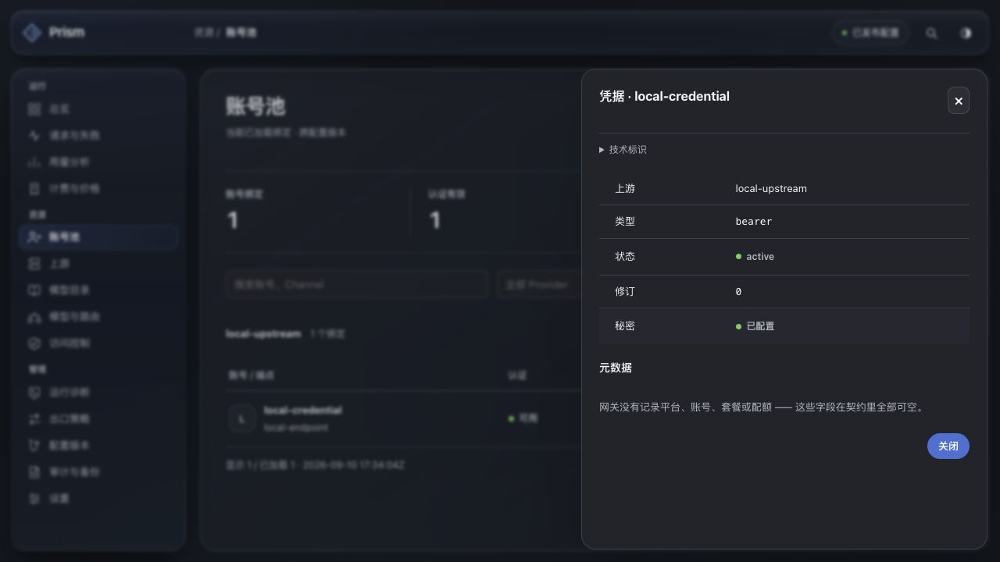
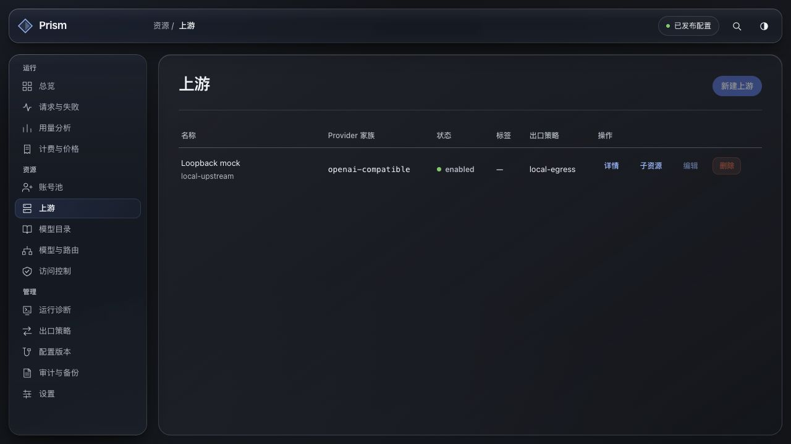

# CPAR 与 CPAMP 功能对照：从管理对象转向用户任务

2026-09-11。结论：当前 Prism 不能因为 14 个页面可打开、已有 API 用例通过，就被判定为可独立使用的 CPA 管理面板。账号接入、凭据管理和日常配置修改存在实际阻断；主导航也偏向实现结构。应先纠正这些问题，再进行视觉设计。

这份报告落实用户最新的产品定位：CPAR 是 Rust 重构的 CPA，面板重点应接近 CPAMP 的网关管理体验。此前“固定 14 个一级栏目”的交付范围不再是下一轮导航约束。历史验收记录保留，但不代表本文列出的接入流程已经通过。

## 取证范围

- CPAR 当前源码：`083f486f8305b7113061c714481374616553f6d3`；生产功能代码为 `8a1b537`，后续 `083f486` 只有交付文档。
- CPAMP 当前 main：[`e1a8788ab796f4d001c5d1e9851c418989b05424`](https://github.com/seakee/CPA-Manager-Plus/tree/e1a8788ab796f4d001c5d1e9851c418989b05424)。读取其导航、路由、账号、OAuth 和官方手册，并实际打开[官方演示](https://seakee.github.io/CPA-Manager-Plus/#/demo)。
- 本轮重新使用内置 Chromium 检查导航和账号路径，截图均为本轮捕获，1280×720、深色。CPAR 使用本地真实 gateway 的合成账号，四个静态资源摘要与 V6 `6b4e9a7` 相同；当前源码到该版本的前端差异仅为名称格式辅助函数及测试，不涉及本文功能。
- CPAMP 演示为虚构数据，只证明界面组织及操作入口，不能证明第三方真实 OAuth、配额刷新或模型调用已经执行。源码和官方文档用于判断功能意图与边界。
- 本次没有修改正式前后端代码、生产数据或部署状态，没有触发真实 Provider 请求、实际 OAuth 登录、凭据导出或清理。产物为本报告、功能重构设计和取证图片。
- [取证清单](../design/cpamp-parity-20260911/capture-manifest.json)记录来源版本、截图尺寸与文件摘要；图片保持浏览器返回的原始 JPEG 字节。

## 1. 主导航对照

CPAMP 的导航由能力开关决定；本次完整模式演示可见十个常规入口，以及两个插件动态页面。它并非只有界面：完整模式还带 Manager Server。CPAR 已有 Rust 存储和运行时，应实现对应用户任务，不需要再部署一个 CPAMP 服务，也不应原样照搬其 Manager Server 连接表单。

| CPAMP 的常规入口 | CPAR 当前对应位置 | 问题与调整方向 |
|---|---|---|
| 仪表盘 | 总览 | 当前主指标是进程累计 attempts 和物化管道；应优先回答请求、账号、费用和异常。进程诊断下沉 |
| 用量分析 | 用量分析＋计费与价格 | 有真实用量和账本基础，但工作区割裂；整合为“用量与费用”，价格作子页 |
| 请求监控 | 请求与失败 | 当前是账本与失败来源的两个视图，不能代表完整请求历史；需要请求级投影 |
| 配置面板 | 配置版本＋出口策略＋部分设置 | 用户应编辑实际网关设置，不必先创建、选择和发布一个版本 |
| AI 提供商 | 上游＋子资源 | 通用 `id/kind/adapter_id` 表单代替了按服务商配置的流程，缺少完整接入引导 |
| 凭证管理 | 账号池＋上游子资源＋凭据详情 | 账号首页不能添加、导入或直接重新授权；运行绑定不等于受管凭据完整清单 |
| OAuth 登录 | 隐藏在凭据详情的 OAuthWizard | 没有面向新账号的授权入口，实际类型判断还会隐藏已有 OAuth 账号的操作 |
| 日志查看 | 请求与失败＋运行诊断 | 运行诊断是 target/Explain/恢复工具，不等同于可检索的服务日志；两者应明确分层 |
| 系统信息 | 设置＋总览 | 现有设置主要是外观、辅助偏好和会话，缺少网关参数与运行信息的完整工作区 |
| 插件管理 | 无直接等价能力 | 取决于 CPA 插件运行时。CPAR 没有对应管理契约，不能添加一个空插件栏目冒充兼容 |

CPAMP 把模型规则分布于 Provider、OAuth 配置和系统模型信息，API Key 配置也不是本次演示里的独立一级菜单。建议为 CPAR 合并为“模型管理”和明确命名的“API 密钥”，这是产品适配，不是声称 CPAMP 原有这两个独立栏目。

来源：[CPAMP 导航](https://github.com/seakee/CPA-Manager-Plus/blob/e1a8788ab796f4d001c5d1e9851c418989b05424/apps/web/src/components/layout/MainLayout.tsx#L514)、[路由](https://github.com/seakee/CPA-Manager-Plus/blob/e1a8788ab796f4d001c5d1e9851c418989b05424/apps/web/src/router/MainRoutes.tsx#L114)、[能力矩阵](https://github.com/seakee/CPA-Manager-Plus/blob/e1a8788ab796f4d001c5d1e9851c418989b05424/apps/docs/reference/capability-matrix.md)、[CPAR 导航](../../web/prism/src/app/navigation.ts)。

## 2. 账号接入的直接问题

### F1 · 高：真实 OAuth 类型与前端判断不一致

`CredentialSheet.tsx:101` 仅对 `row.kind === "oauth"` 展示“轮换令牌／重新授权”。后端 `persist_oauth_credential_if_revision` 明确持久化 `oauth_json`，`CredentialResponse::from` 原样返回 kind，刷新接口也要求 `oauth_json`。因此真实 Codex OAuth 凭据即使被找到，其重新授权按钮仍会消失。

开发 fixture 却使用 `kind: "oauth"`，使这一条件能在模拟数据中成立。该缺陷是源码交叉核对确认的；本轮没有对生产 OAuth 账号执行登录或刷新。

证据：[前端判断](../../web/prism/src/features/upstreams/CredentialSheet.tsx)、[fixtures](../../web/prism/src/dev/fixtures.ts)、[持久化类型](../../crates/gateway-control/src/management_mutation_service.rs)、[HTTP 序列化与刷新](../../crates/gateway-http-actix/src/management_resources.rs)。

### F2 · 高：默认新建凭据类型不能通过运行装配

上游子资源的新建账号表单把 `kind` 默认设为 `api_key`。运行装配的 `validate_p12_credential_bindings` 对启用凭据只接受 `bearer` 或 `oauth_json`。底层创建接口只限制 kind 的文本长度，不替用户选择合适类型。

按表单默认值创建，可能完成存储，却无法成为可运行的启用配置。新用户不应理解并填写内部 kind。需要按服务商与授权方式选择并校验真实类型。

证据：[新建账号表单](../../web/prism/src/features/upstreams/SubresourcePanel.tsx)、[请求校验](../../crates/gateway-http-actix/src/management_resources.rs)、[运行装配](../../apps/gateway/src/runtime.rs)。

### F3 · 高：账号首页不是受管账号的完整工作区

首页只提供刷新、筛选、绑定状态和详情；没有“添加账号”“授权登录”“导入凭证”。查看已有凭据至少要经过：账号池 → 详情 → 配置与失败 → 查看凭据与绑定。

列表来自 `listProviderAccountPools` 的运行绑定，上游子资源来自 `listOperationalAccountPools`。未绑定、尚未进入运行态的新凭据无法靠这些投影完整枚举。权威 OpenAPI 有凭据单项读写，但没有独立的完整凭据／端点列表。只在首页补一个按钮仍不能闭环。

证据：[账号页](../../web/prism/src/features/accounts/AccountsPage.tsx)、[子资源页](../../web/prism/src/features/upstreams/SubresourcePanel.tsx)、[权威 OpenAPI](../openapi/management-v1.json)。

### F4 · 高：OAuth 入口尚不能表达不同平台的真实能力

`serve` 装配的是 `CodexOAuthManagementWorkflow` 和 `OpenAiCodexOAuthExchange`；管理 OAuth 启动 handler 只查凭据存在，然后进入同一个工作流。现有契约没有按平台报告可用授权方式的能力目录。

不能简单为所有账号显示一个通用“OAuth 登录”按钮，也不能将 Grok、Kiro 或 CPAMP 的其他平台按钮都接向 Codex。应先定稿平台／渠道能力和授权分派；复用各 Provider 已有实现时必须逐个核对管理端接线。

证据：[运行装配](../../apps/gateway/src/deployment.rs)、[OAuth 管理 handler](../../crates/gateway-http-actix/src/management_resources.rs)、[现有前端向导](../../web/prism/src/features/upstreams/OAuthWizard.tsx)。

### F5 · 高：修改普通配置需要理解版本，且 parent 不是克隆

已发布状态下“新建上游／编辑／删除”均禁用。用户必须去配置版本页手动创建和切换草稿，再回来操作。

更关键的是，当前 `createConfigVersion` 最终调用 `create_empty_configuration`：`parent_id` 仅保存关联，不复制已有资源图。不能把“后台自动创建一个 parent 指向当前版本的草稿”当成安全编辑方案。必须实现真正的服务端复制或事务变更应用，保留无关提供商、账号、路由和授权；凭据的加密关联数据含配置版本，跨版本复制还需要在服务端重新封装。

证据：[创建 handler](../../crates/gateway-http-actix/src/management_lifecycle_resources.rs)、[空配置创建](../../crates/gateway-control/src/management_service.rs)、[秘密封装](../../crates/gateway-control/src/management_mutation_service.rs)、[前端只读门槛](../../web/prism/src/features/upstreams/UpstreamsPage.tsx)。

### F6 · 中：改状态仍被要求重新输入秘密

`CredentialInput` 的 secret 必填且不能为空，PATCH 使用同一整体输入。表单因此要求仅修改状态时也重填秘密。账号启停、备注、优先级、绑定配置与秘密轮换应分开；一般管理动作不应该依赖用户重新获取原凭据。

证据：[输入定义与校验](../../crates/gateway-http-actix/src/management_resources.rs)、[编辑表单](../../web/prism/src/features/upstreams/SubresourcePanel.tsx)。

## 3. 栏目背后的产品缺口

| 用户任务 | 已有基础 | 仍缺少的闭环 |
|---|---|---|
| 新增一个 OAuth 账号 | Codex start/status/callback/cancel/refresh、持久化与续期 | 从平台选择开始；无需先构造带 secret 的空凭据；成功后清晰显示账号和接入状态 |
| 导入已有 CPA/Sub2API 账号 | 兼容凭据解析、加密存储、单项 create/update | 文件／JSON 导入、批量预览、去重、逐项结果、重试与完整账号列表 |
| 配置一个第三方 API 服务 | Upstream/Endpoint/Credential/Binding CRUD、测试与目录发现部分能力 | 一个按类型组织的表单；正确默认值；保存并生效；不要求手工创建内部对象图 |
| 给客户端一个能用的 Key | Access Group、Client Key、模型路由授权 | 简单的 Key 名称／模型范围／有效期流程；自动生成必要授权关联并说明何时生效 |
| 确定模型能否调用 | 目录、effective models、Route/Candidate/Alias、Explain | 合并为模型工作区，区分上游拥有、当前接入、Key 获准；不要求普通用户维护路由图 |
| 找到一次失败请求 | 持久事件、失败来源、attempts、账本 | 完整请求索引；认证拒绝、零 token、取消、流式中断也能查；请求不是账本行或 attempt 的别名 |
| 查看一天的请求与费用 | 用量及账本、有界查询、计价置信度 | 请求级时间窗汇总、趋势、延迟与正确的分母；本轮不把现有进程计数解释成这些指标 |
| 调整网关设置 | 出口策略和部分已有配置实体 | 可用参数与只读部署参数目录、变更来源／生效方式；现有设置主要只是界面偏好 |

“开源”不使运行配置的原子生效、回滚和操作记录失去意义，但这些机制没有必要占据主导航。应从用户界面撤下“配置版本”“审计与备份”一级入口，后台保留机制；变更记录、恢复工具放到设置的高级区域，具体对象的修改记录放在其详情中。

参考 CPAMP 的[账号手册](https://github.com/seakee/CPA-Manager-Plus/blob/e1a8788ab796f4d001c5d1e9851c418989b05424/apps/docs/manual/accounts.md)、[提供商手册](https://github.com/seakee/CPA-Manager-Plus/blob/e1a8788ab796f4d001c5d1e9851c418989b05424/apps/docs/manual/ai-providers.md)、[配置手册](https://github.com/seakee/CPA-Manager-Plus/blob/e1a8788ab796f4d001c5d1e9851c418989b05424/apps/docs/manual/configuration.md)、[OAuth 手册](https://github.com/seakee/CPA-Manager-Plus/blob/e1a8788ab796f4d001c5d1e9851c418989b05424/apps/docs/manual/oauth.md)。CPAR 证据为当前 OpenAPI、`MonitoringPage.tsx`、`SettingsPage.tsx`、`AuditBackupPage.tsx` 和上述代码。

## 4. 本轮实际界面检查

1. **CPAMP 仪表盘，正常可浏览。** 主导航包含面向账号和提供商的入口；指标以使用问题组织。演示数字不是实际服务证据。

   

2. **CPAMP 凭证管理，入口完整。** 首页可见粘贴 JSON、上传文件、平台过滤、批量操作；运行、额度与账号信息在同一工作区。

   

3. **CPAMP OAuth 登录，入口清楚。** 按平台选择；保留其独立 OAuth 入口作为对照。未点击真实平台授权。

   

4. **CPAR 总览，可浏览但信息优先级不合适。** 首屏突出进程尝试和处理管道。没有数据造假，但不满足主要使用问题。

   

5. **CPAR 账号池，添加／授权任务缺入口。** 顶部只有刷新；Provider ID 还要求使用者理解内部标识。

   

6. **CPAR 账号详情，路径过深。** “配置与失败”内才能找到“查看凭据与绑定”，任务名称与授权目的不匹配。

   

7. **CPAR 凭据详情，可读。** 本次合成账号类型为 bearer，所以此截图不用于证明 OAuth 类型 bug；F1 的证据是实际代码的数据链路。嵌套切换后 AX 焦点仍报告背景“详情”按钮，需在改造中专项复查焦点管理。

   

8. **CPAR 上游，常规编辑被版本流程阻断。** 已发布配置下新增与编辑禁用，需跨页处理底层版本。

   

本次审查重点是功能入口与任务路径，不是完整 WCAG、移动端、全部 Provider 或在线业务操作验收。所有图片已保存并打开核对；截图不能证明授权交换、导入落库、真实余额和推理成功。未执行新的代码测试，不复用上次测试数量给本次功能审查背书。

## 5. 下一轮验收标准必须改变

从空安装起，由浏览器完成：管理员登录 → 添加账号／提供商 → 授权或导入 → 查看可用模型 → 创建客户端 Key → 受控请求 → 请求记录与用量费用。不能先用脚本填完整配置，再仅验收剩余编辑和页面导航。

脚本预置仅用于独立底层回归；关键产品验收应覆盖真实 `oauth_json`、未绑定账号、重新授权、无需重填秘密的启停、已有配置保留、失败后继续编辑与应用冲突。具体设计和实现顺序见 [功能重构方案](../handoffs/prism-cpamp-functional-redesign.md)。
