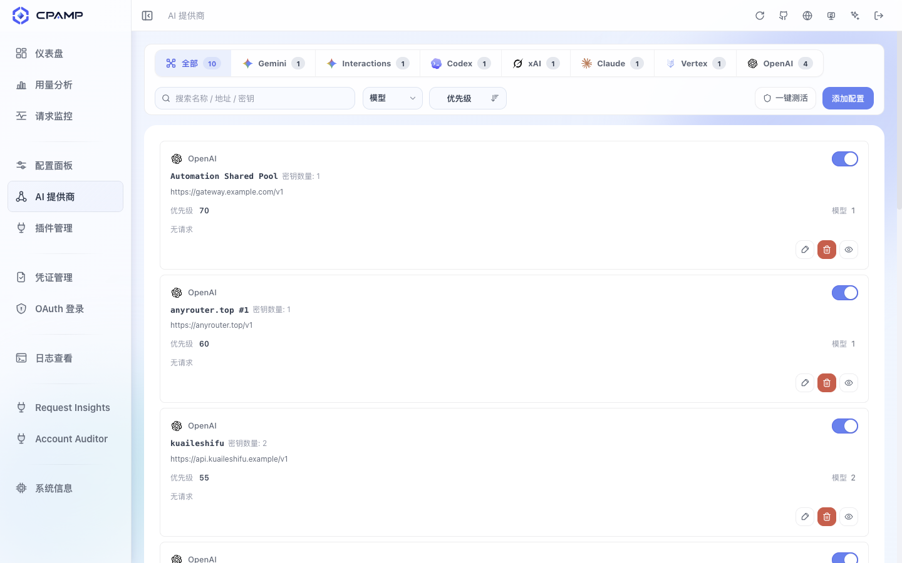
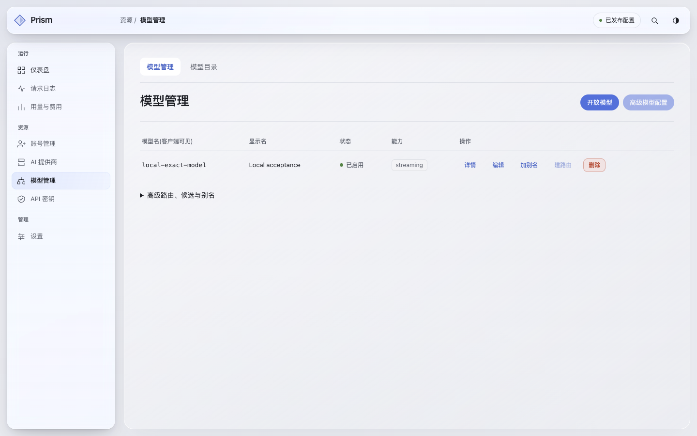
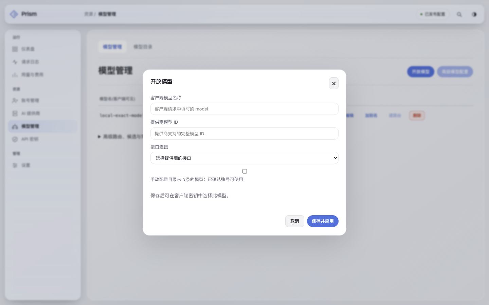
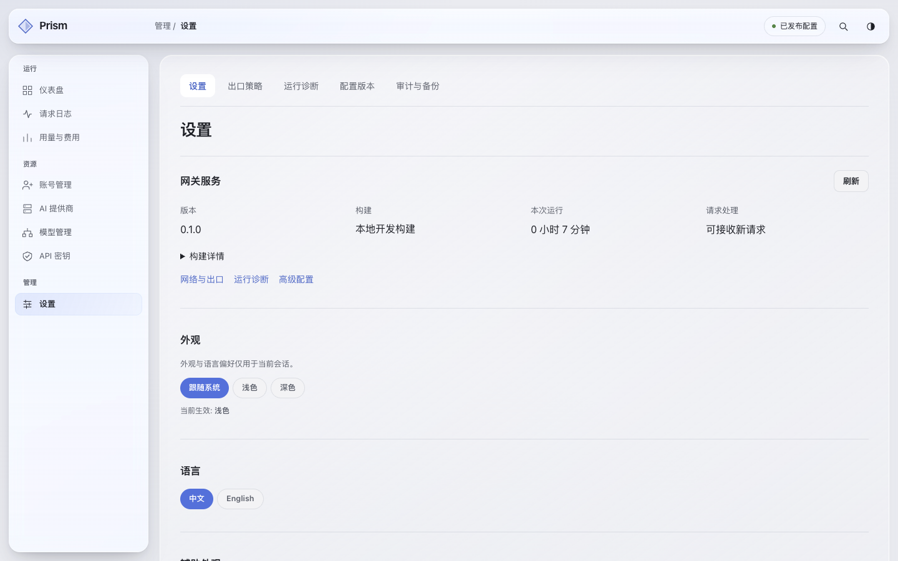

# 原始模型与管理流程审查

2026-09-13，本次实施前以 EgoLite 截图和实际操作核对。既有 V6 Liquid Glass 保留，重点是功能组织与操作层级。

## 来源

- [CPAMP e19d826](https://github.com/seakee/CPA-Manager-Plus/tree/e19d8267a52ca146c43bdb86d185bb7baed7ff38)：提供商入口、模型输入组件、按名称搜索、多模型选择与批量应用。普通模型的 name 是上游 ID，alias 为可选项。
- [CLIProxyAPI ac02da6](https://github.com/router-for-me/CLIProxyAPI/tree/ac02da6c05e18f465aa7e3ed5b0a65a2f060917d)：管理资产默认仍加载官方 Center，配置支持模型数组和独立别名。
- [官方 Center f4b3043](https://github.com/router-for-me/Cli-Proxy-API-Management-Center/tree/f4b304365142bc9dd151e79539a409b9a05bfa70)：ModelDiscoveryPanel 搜索/选择/批量应用、BaseProviderForm 与 MainLayout 的页面组织。

本轮读取三个当前修订的相关源代码；前次全模块索引仍见[差异矩阵](prism-cpa-alignment-matrix-20260912.md)。这里不声称逐行完成三个仓库的安全审计，也不复制其所有插件、媒体协议或自动巡检能力。

## 流程与证据

1. **进入提供商工作区：参考结构清楚。** 提供商包含多个模型，数量属于该提供商的配置概览，模型与接口是其下的资源。CPAR 原来的独立底层对象表格需要来回寻找关联。采用提供商卡片、接口摘要、已配置模型和目录/批量接入入口。

2. **查看 CPAR 模型列表：来源信息不足。** 模型名和显示名重复占列，路由按钮占主操作，真实来源/协议不在列表。改为模型 ID、来源连接、状态，别名和底层路由放到高级操作。

3. **接入模型：存在明显阻力。** 必须输入两套名称，只有一个模型输入，且复选框与说明分离。默认改为按行输入真实 ID；同名增加来源，重复连接保持原状态。别名只作为显式可选项，创建别名不能另外制造第二个同名上游模型路由。

4. **系统设置：维护功能层级过高。** 配置版本与审计和日常外观并列，系统卡片又重复提供入口。保留原链接，把维护工具收进一个明确的高级维护分组。

截图为本次重新捕获并查看的实际页面；模型表单第一次捕获处于动画中，已丢弃并以稳定帧覆盖。参考站最初错误 URL 的 404 不作为审查证据。

## 验证边界

截图确认了层级、文案重复、字段布局与动作位置；键盘焦点、会话失效、分页一致性和实际调用必须以实施后的操作/接口测试验证，不凭截图声称符合全部无障碍标准。生产旧名称仍须在权限等价验证、备份和隔离副本演练后整理，不能只清洗显示文本。
