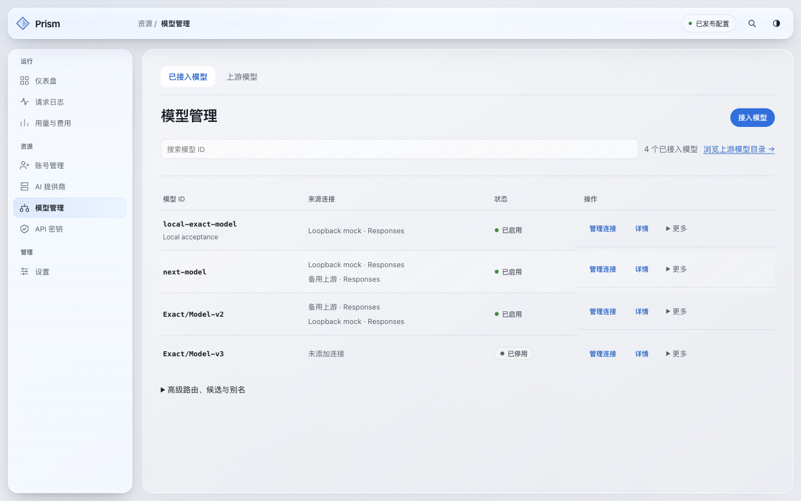
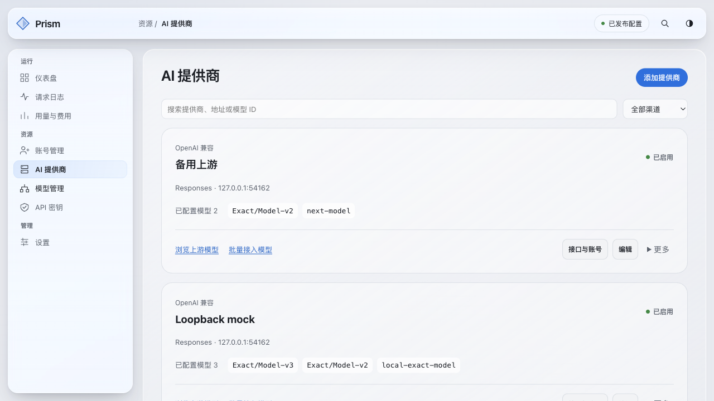
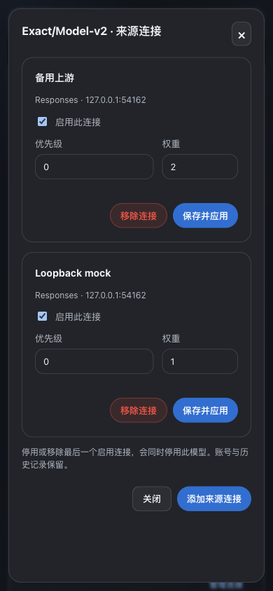
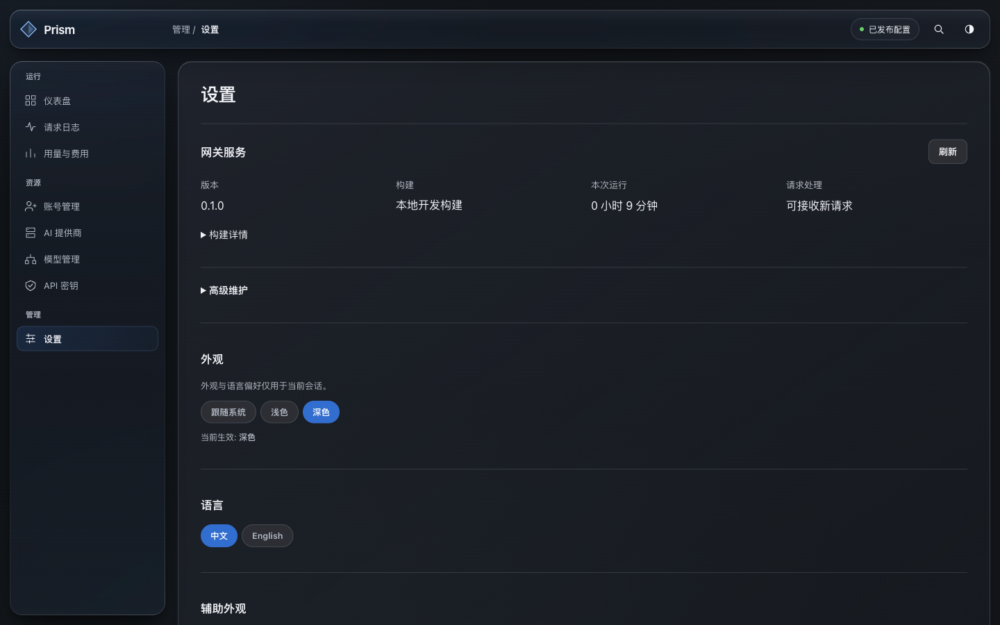
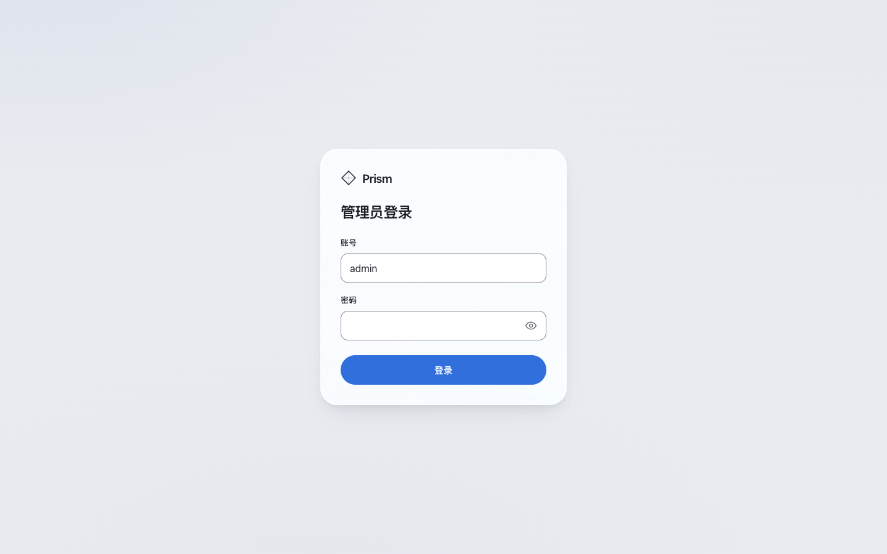

# 原始模型与管理工作区交付

2026-09-13。应用修订 `57e32d1b6c550c3e8b8ab63163cad1e277a962ab`。

**已上线并完成公网验收。** 现有域名运行签名修订 `57e32d1`、schema26，活动配置为 `production-models-20260913`。服务停止到就绪1036ms；公网四资产与CSP、无鉴权管理拒绝、健康检查，以及主机内鉴权模型/别名/有效模型上下文重读通过。

[完整验收回执](evidence/prism-model-workspace-20260913/acceptance.json)。保留2229条历史事件、593条账本、5个原生账号、2个普通账号、单个Codex凭据/运行连接和管理员库；未执行生产数据清理或新的人工Provider请求。

## 实现

- **模型管理：** 默认按上游 exact ID 接入，一次粘贴/选择 1–20 个模型。一个上游可有多个模型，同一原名模型可配置多个来源；重复接入保持原连接的状态、权重与授权。可选别名创建 alias，不创建第二个模型。列表以模型 ID、来源/协议、状态和连接操作为主。
- **来源维护：** 右侧详情可以添加、修改优先级/权重、停用或移除来源。最后一个启用来源移除时停用该模型，保留账号与历史。高级路由、候选和别名仍保留。
- **上游目录：** 按提供商、接口、真实目录账号读取已有观测，支持搜索、分页、多选接入。新 GET `/admin/catalog/models` 具备独立只读事务、目标隔离、游标/配置/目录一致性与100条页上限。缺失、成功空目录、已过期与最近未返回分别表达，不把目录证据当授权。
- **AI 提供商：** 同一张卡片包含接口协议/地址、已配置原始模型、多模型接入和接口/账号维护。支持按提供商、地址、模型、渠道筛选，展开内容留在对应卡片中。
- **设置与运营：** 高级维护集中于设置折叠区，原有配置版本、审计等链接保留。健康计费处理状态折叠，异常仍直接显示。删除日常界面中的操作名、契约和重复说明。
- **数据面：** 新 exact-model 执行入口在配置明确的多个 Provider 来源中使用 Route 策略；单 Provider 保留原价格策略。复用协议语义过滤、快照、租约、Health/Quota、目录过期、重试预算和事件链路。自定义混合映射仍保留 Provider 范围限制；Channel Pin 与续接固定来源不变。原名模型的可选别名继承 exact-model 范围。

保持 V6 Liquid Glass、同源管理鉴权、内存秘密、CSP 和四个嵌入文件。Schema 仍为26，权威契约同步为130个操作，无新依赖。

## 工作区完整性

| 日常工作区 | 保留的页面与功能 |
|---|---|
| 仪表盘 | 总览、费用/资源概览、诊断深链 |
| 请求日志 | 请求与失败、attempts、诊断入口 |
| 用量与费用 | 用量分析、账本、价格、处理状态 |
| 账号管理 | 全部账号、运行状态、授权/导入/替换、批量维护；沿用上一发布的10个渠道入口 |
| AI 提供商 | 接口/账号配置、多模型清单、目录与批量接入 |
| 模型管理 | 已接入模型、上游目录、客户端有效模型检查、来源连接、高级路由/候选/别名 |
| API 密钥 | 按允许模型签发、有效期、访问组、撤销；有效模型与目录分别表达 |
| 设置 | 系统信息、外观、辅助偏好；高级入口保留运行诊断、出口策略、配置版本、审计与备份 |

14个原管理路由及其旧链接/query均保留，解锁/管理员登录机制沿用。此表区分本轮改进与既有功能，未新增全渠道 discovery、媒体协议或真实 Provider 自动巡检。

## 本次验证

- 前端：286项测试；类型检查、130操作契约检查与四文件双构建通过。
- Rust：179项 router、71项 HTTP library、132项 gateway、16项管理 inventory、3项嵌入资源测试通过；全工作区 Clippy、格式、边界、源码策略、契约引用、文档链接、秘密扫描通过。
- EgoLite（Chromium152）实际应用：手动批量两个原名；目录中已有模型添加第二来源并接入新模型；权重修改重读；可选别名无重复模型；最后来源移除后模型停用；批量成功跳转；搜索空态；详情键盘焦点/Tab/Escape/焦点恢复。
- 真实本地 gateway：UI签发的密钥只允许两个模型；两个原始模型 Responses 请求成功到TLS loopback Provider；同模型的两个来源均收到原始 ID；别名同样转换为该原始 ID；未授权模型404；持久事件到计费账本完成。目录数据来自受控 mock 返回并由验收工具存入临时状态，不声称通用渠道已实现自动 discovery。
- 1440×900、1280×720、390×844共42次管理入口布局/渲染检查，无整页横向溢出或路由错误。人工查看本次改动页面的桌面/移动端截图；手机表格保留局部横向滚动。来源面板390宽时366px，左右12px。深色、减少动效/透明、提高对比度检查完成；不宣称全面WCAG认证。
- Generic Responses 端点声明 Reasoning 时，Chat转换仍按现有规则拒绝，Explain返回 `protocol_transform_unavailable`；本次没有扩大其协议能力。

签名构建：[release-artifact](https://github.com/Ricardo121380/cpa-rust-gateway/actions/runs/34744622126)。正式门禁：[Fast与供应链](https://github.com/Ricardo121380/cpa-rust-gateway/actions/runs/34744623624)。两者针对同一应用修订且成功；ARM64已独立验证签名、SBOM、binary与四资产，并通过真实ARM64隔离管理员鉴权测试。

## 生产模型整理与回滚

已将6个历史验收名称整理为 `gpt-5.5`、`gpt-5.6-terra`、`grok-4.20-0309`、`grok-4.5`。6个旧名称作为兼容别名保留，不再占模型列表。

Krill三条记录实际共用同一接口、同一模型、同一凭据范围、优先级/权重与能力声明，访问组集合也相同。已有 `canonical_bridge` 的同/跨协议语义检查覆盖 `canonical` 和 `lossless_bridge`。存储对同路由/接口/模型/凭据范围唯一约束，不能直接并排搬入三条；因此保留现有桥接候选并移除两条重复配置，历史配置不删除。各原始模型的授权与实际源接口保持。

已对线上只读图生成指纹，备份后完成隔离生产副本演练：真实管理API fork、修改/合并、别名、校验、条件发布与重读；用旧1b81ce7/schema26加载同一新配置验证回滚。正式整理已比较源图指纹与修订，409未重放。两次演练暴露并解决了重复候选唯一约束和验收工具误把观测时钟当作稳定投影比较的问题；失败均发生在隔离副本，未改线上状态。最终比较保留projection_id与模型/权限内容，只排除响应观测时刻。

回滚仅限已验证的同schema26二进制切换，保留最新状态、轮换令牌、管理员库与请求/账本；不能恢复旧数据库，也不能运行此前26→25降级。用户后续发布新的多Provider原名路由后，回滚旧执行器前须重新审查兼容性，优先向前修复。

## 人工验收入口与范围

现在使用原有管理员账号访问 [Prism](https://cpar.142857142.xyz/admin-ui/)。建议依次查看 AI 提供商 → 模型管理 → 上游模型 → API 密钥，以及设置的高级维护；本轮不提供新管理员密码。

保留历史请求和账本、账号和密钥，不改DNS/Caddy/Autoreg，不清理生产数据、不发起新的人工真实Provider请求。两条历史Console账号缺少邮箱的既有403问题未在本轮重试；不会编造邮箱或恢复“读取身份”按钮。

## 画面与运行证据

下列主界面截图来自本次真实本地 gateway 的合成账号/模型，不是独立原型或 fixture 服务。

公网浏览器确认管理员登录入口并保留给用户；本轮未读取或替换生产管理员密码。受保护页面的数据由主机内管理鉴权重读验证，尚待用户使用现有密码进行人工验收。

应用提交57e32d1与发布产物一致；随后的交付文档提交不改变运行二进制。私有演练、配置备份与操作回执位于Oracle `/var/backups/cpa-rust-gateway/prism-model-workspace-20260913`；不将其数据库或凭据导出到报告。
