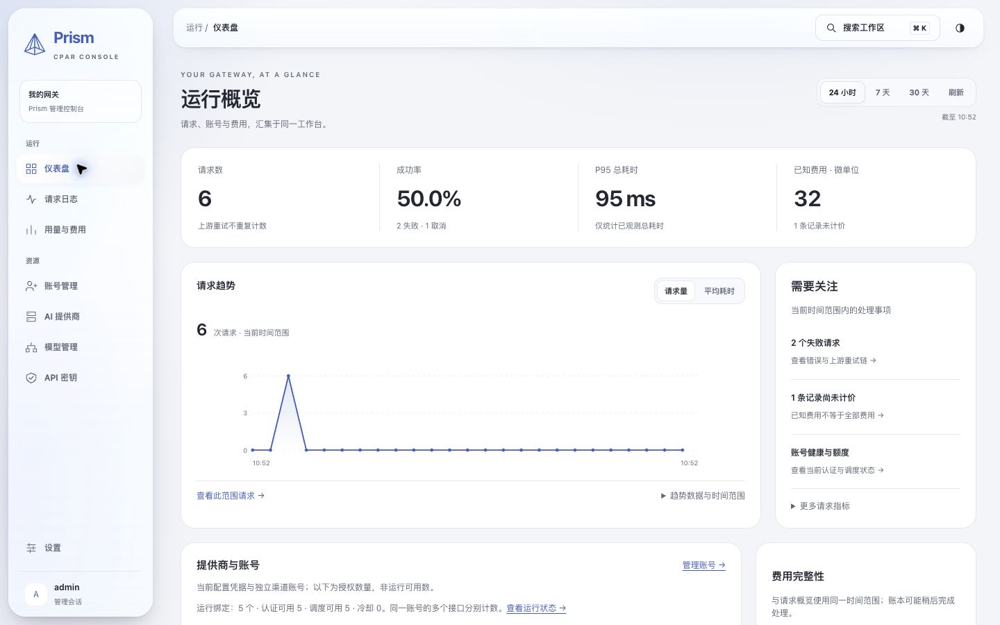
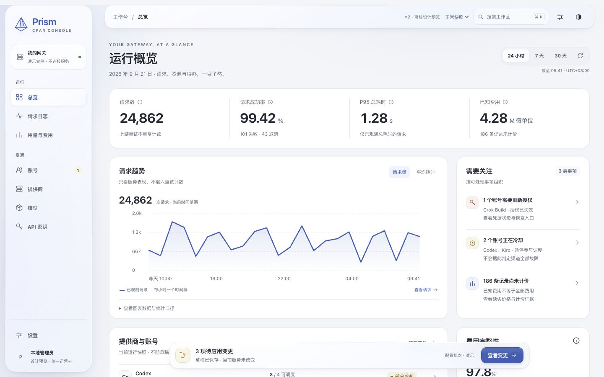
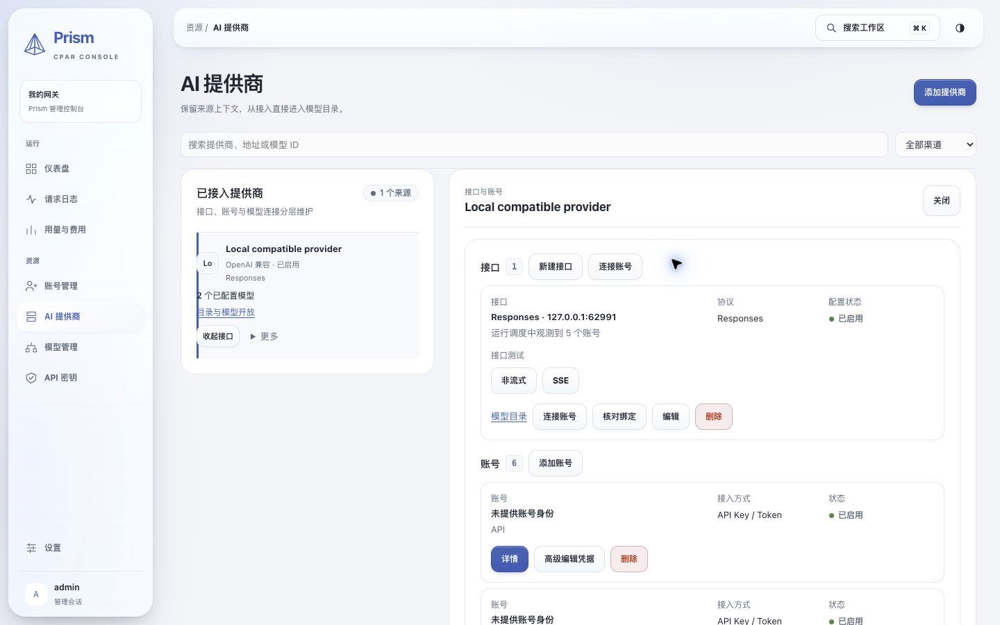
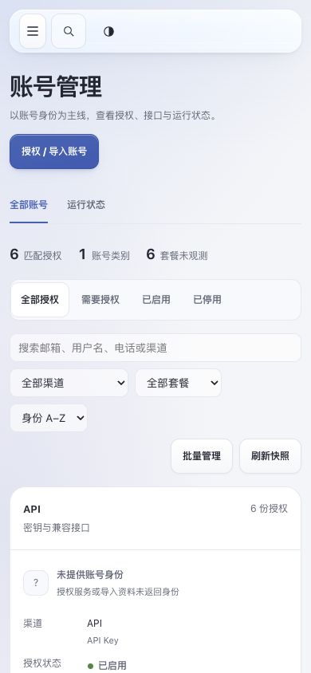
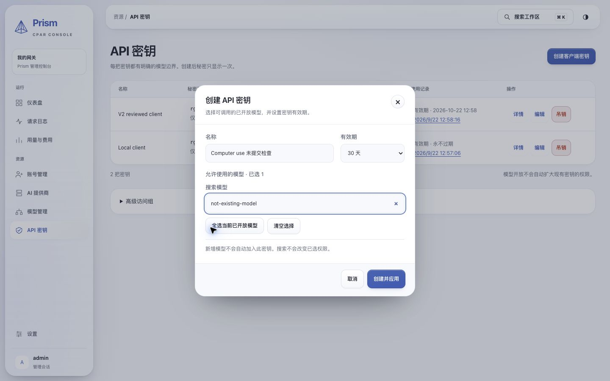

# Prism V2 Computer Use 实际操作验收 · 2026-09-23

## 结论

**本轮已检查的导航、表单校验、未保存保护和详情查看可用；暂不通过“完整复刻 V2”的最终视觉验收。** 四项可复现的视觉/交互缺口需要整改。未发现本轮已走查路径上的页面崩溃，但这不是所有功能、所有数据状态或生产环境的完整通过证明。

本报告只使用本轮 Computer Use 交互与截图。既有报告中的测试数量、90 状态矩阵和功能结论没有计入本次通过项。

## 对象与边界

- 代码参考：本地 HEAD `65bae6b`（`feat(prism): close V2 workspace and dialog visual gaps`）。本轮使用已有 `target/debug/gateway`，未重新编译或核验二进制与 HEAD 的逐字节对应关系。
- 实际应用：`http://127.0.0.1:62992/admin-ui/#/`，真实 gateway 嵌入的 Prism，使用既有隔离本地状态目录和合成验收数据。
- 设计参考：`docs/design/chatgpt-prism-liquid-v2`，本地 `http://127.0.0.1:63008/`。原型样本数值不作为真实业务数据要求。
- 浏览器：EgoLite（`com.citrolabs.ego.lite`），经 `mcp__cua_repl` Computer Use 操作。连接工具将浏览器提供器标为 Chrome/extension；本次未使用 Safari，也未另启 Playwright 测试进程。
- 检查尺寸：1440×900 的八个主栏目；390×844 的总览、移动导航、账号、渠道选择、密钥表单和搜索；1280×720 的深色提供商详情。并非每个栏目在每个尺寸/主题下都重新检查。
- 检查方式：实际点击、输入、选择、滚动、Tab、Enter、Escape、取消，以及截图观察。对设置中的主题、降低透明度、高对比度、减少动效进行切换并恢复。
- 未执行：生产部署、生产数据修改、真实推理、官方授权提交、账号导入提交、创建/撤销密钥、删除资源或权限变更。表单输入均未提交并经取消退出。
- 当前本地账号样本是 API 类合成记录，不能据此验收真实邮箱、多渠道身份合并和真实上游目录完整性。

## 验收路径与证据

所有截图均为本轮采集，保存在 [截图目录](assets/prism-v2-computer-use-20260923/)。

| 步骤 | 实际操作 | 结果及限制 | 截图 |
|---|---|---|---|
| 1. 预览恢复与登录 | 检查本地预览，恢复已有 gateway 与原型静态服务，使用既有管理员登录 | 原服务已经停止，属于环境问题；恢复后成功进入应用。未改变管理员口令 | [总览](assets/prism-v2-computer-use-20260923/01-overview-actual.png) |
| 2. 总览 | 查看时间范围、指标、趋势、关注事项及下方内容，与 V2 同尺寸截图比较 | 显示已有 6 条请求、50% 成功率和已知费用；下方结构及关注事项设计仍有差异，见 CU-01 | [实际](assets/prism-v2-computer-use-20260923/01-overview-actual.png)、[V2](assets/prism-v2-computer-use-20260923/02-overview-reference.png)、[下方区域](assets/prism-v2-computer-use-20260923/29-overview-lower.png) |
| 3. 账号与 Kimi 入口 | 进入账号管理，点击授权/导入，选择 Kimi Coding，再取消 | 进入本渠道授权/导入入口，没有要求选择 Codex/Krill 提供商或无关接口；未点击官方授权提交，不能视为真实授权成功 | [账号](assets/prism-v2-computer-use-20260923/03-accounts-actual.png)、[Kimi](assets/prism-v2-computer-use-20260923/04-kimi-entry.png) |
| 4. 提供商 | 打开提供商，再展开“接口与账号”工作区 | 可看到配置协议 Responses、接口地址及关联账号；操作入口存在，但信息层级较重，见 CU-02。未点击接口测试和删除 | [列表](assets/prism-v2-computer-use-20260923/05-providers.png)、[详情](assets/prism-v2-computer-use-20260923/06-provider-detail.png) |
| 5. 模型与离开保护 | 打开接入模型表单，输入未提交内容，Escape，选择继续编辑，再退出并放弃 | 出现未保存确认；继续编辑保留输入，放弃后关闭。模型未写入 | [模型](assets/prism-v2-computer-use-20260923/07-models.png)、[表单](assets/prism-v2-computer-use-20260923/08-connect-model.png)、[保护](assets/prism-v2-computer-use-20260923/09-unsaved-guard.png) |
| 6. 密钥表单 | 填写名称，观察未选模型时按钮，选择一个 exact ID，再搜索不匹配文本 | 未选择时提交禁用；搜索后已选数量仍为 1，权限没有随过滤清空。缺少无匹配提示及已选模型摘要，见 CU-04。未签发密钥 | [列表](assets/prism-v2-computer-use-20260923/10-keys.png)、[表单](assets/prism-v2-computer-use-20260923/11-create-key.png)、[空搜索](assets/prism-v2-computer-use-20260923/12-key-search-empty.png) |
| 7. 请求与失败详情 | 打开请求列表，查看失败的流式请求；输入不存在的模型筛选，再重置 | 失败详情包含结果、总耗时/首内容延迟及一次尝试链；无匹配时明确显示空态且导出禁用；重置恢复列表。未新发请求 | [请求](assets/prism-v2-computer-use-20260923/13-requests.png)、[详情](assets/prism-v2-computer-use-20260923/14-request-detail.png)、[空态](assets/prism-v2-computer-use-20260923/30-request-empty.png) |
| 8. 用量与费用 | 查看已有请求、费用和 token 信息 | 已知费用与未计价记录分别表达，未观测信息未被填成零。本轮仅查看，未同步或修改价格 | [用量](assets/prism-v2-computer-use-20260923/15-usage.png) |
| 9. 设置及辅助偏好 | 切换深浅色、降低透明度、高对比度、减少动效 | 控件状态与外观变化可见；结束后恢复跟随系统及原辅助偏好。未做全站对比度量测或完整 WCAG 审计 | [浅色](assets/prism-v2-computer-use-20260923/16-settings-light.png)、[深色](assets/prism-v2-computer-use-20260923/17-settings-dark-desktop.png)、[辅助偏好](assets/prism-v2-computer-use-20260923/18-accessibility.png) |
| 10. 手机与窄桌面 | 390×844 操作导航、账号、渠道入口、密钥表单；1280×720 查看深色详情 | 所查主要操作未要求横向滚动；手机账号首屏主体过晚，见 CU-03；深浅色密钥弹窗底部操作可见 | [手机总览](assets/prism-v2-computer-use-20260923/20-mobile-overview.png)、[导航](assets/prism-v2-computer-use-20260923/21-mobile-nav.png)、[账号首屏](assets/prism-v2-computer-use-20260923/22-mobile-accounts-top.png)、[账号下方](assets/prism-v2-computer-use-20260923/23-mobile-account-card.png)、[渠道](assets/prism-v2-computer-use-20260923/24-mobile-channel-chooser.png)、[密钥浅色](assets/prism-v2-computer-use-20260923/25-mobile-create-key.png)、[密钥深色](assets/prism-v2-computer-use-20260923/26-mobile-create-key-dark.png)、[1280 深色详情](assets/prism-v2-computer-use-20260923/28-provider-detail-1280-dark.png) |
| 11. 键盘与全局搜索 | Tab 移动焦点、Escape 退出表单、搜索“请求”后以 Enter 跳转 | 桌面 Enter 导航成功，移动点击结果可用。一次 `Return` 调用不跳转在标准 Enter 后未复现，因此不列为产品缺陷；未声称移动键盘全覆盖 | [手机搜索焦点](assets/prism-v2-computer-use-20260923/27-mobile-search-focus.png) |

结束时回到已登录的总览，保留应用与设计对照标签页，关闭临时移动端标签，复位临时视口。结束时读取的当前应用标签 error 日志列表为空；此结果只覆盖工具实际捕获范围，不替代所有浏览器/生产错误监控。

## 待整改问题

优先级 P2 表示影响日常易用性或本轮设计验收，需要在 V2 复刻签收前处理；本次未确认 P0/P1 阻断缺陷。

### CU-01 · 总览内部结构仍未充分对齐 V2 · P2

- **位置与复现**：总览 1440×900，查看 KPI、右侧“需要关注”，再滚动至费用完整性区域。
- **观察**：V2 参考使用带图标和轻色底的关注事项、较明确的数值/单位层级及费用完整性的主指标结构；当前实现仍较偏文字清单，数值与单位层级弱，费用完整性拆成多项指标，并出现额外的继续查看/资源概览内容。
- **影响**：外壳相似，内部布局与信息节奏仍不同，不能据导航和配色相近就签收完整复刻。
- **建议**：按参考重排关注事项与费用完整性组件，统一指标单位字号，将必要的解释放进二级披露。保留真实数据、缺价和未知语义，不复制演示数值或编造提醒。
- **通过标准**：相同尺寸与相同业务状态下并排对照，主次层级、区块关系、间距和行结构一致；数据差异独立记录。

### CU-02 · 提供商详情层级过重、行操作分散 · P2

- **位置与复现**：AI 提供商 → 接口与账号。
- **观察**：右侧工作区叠加多层面板/卡片/边框；接口测试、连接账号、核对绑定、编辑、删除分散在同一区域，账号卡片再重复按钮和边框。1280×720 下需较多纵向滚动。
- **影响**：管理员难以快速区分主要动作与低频维护动作，未形成参考设计的紧凑列表与详情节奏。
- **建议**：保留两栏工作区，降低嵌套层级；每类对象保留一个主动作，其余收拢到一致的更多菜单。接口协议、地址、状态保持固定位置。
- **通过标准**：接口与账号详情在 1440/1280 下层级明确；390 下主操作可见且无需横向滚动；所有既有操作仍可达。

### CU-03 · 手机账号页筛选区域占据过多首屏 · P2

- **位置与复现**：390×844 → 账号管理 → 全部账号。
- **观察**：标题、说明、授权按钮、页签、统计、状态筛选、搜索、渠道/套餐/排序、批量操作多行堆叠。第一组卡片约在 y=610 开始，第一条账号身份约在 y=720 才出现。
- **影响**：用户进入账号页后，首屏几乎只见筛选控件；查看账户及管理动作需要先滚动。不是溢出问题，而是信息优先级问题。
- **建议**：保留搜索、核心状态与授权主按钮；渠道、套餐、排序收拢进一个带生效数量的筛选入口，批量管理改为选择状态下显示。
- **通过标准**：390×844 正常状态的首屏能识别至少一条账号及其主要动作，筛选仍可访问且状态清楚。

### CU-04 · 创建密钥的模型搜索空态缺少反馈 · P2

- **位置与复现**：API 密钥 → 创建 → 输入名称 → 选择模型 → 搜索 `not-existing-model`。
- **观察**：结果区域直接消失，只剩“已选 1”和通用说明；没有无匹配提示，也不能直接看见已选 exact ID。创建按钮可用，因为选择仍保留；此行为本身不等于越权。
- **影响**：用户难判断是没找到结果、加载失败，还是权限被清空，也不便核对即将签发的权限。
- **建议**：显示“没有匹配模型”和清除搜索动作；在过滤结果之外保留已选模型摘要及移除入口。
- **通过标准**：无匹配、无已开放模型和加载失败分别明确；搜索不改变选择；提交前可检查已选 exact ID。

## 覆盖缺口与下一步

1. **先修 CU-01～CU-04，再用相同操作、相同视口复测。** 不以截图数量替代视觉对照结论。
2. **补有真实形态的多渠道、长邮箱、多接口、多模型数据场景。** 当前 6 条 API 合成账号无身份，无法证明生产身份展示、去重和 Grok/Kimi 等渠道详情已完全正确。应在隔离环境使用脱敏元数据与受控 fixture，不将演示数据写入生产。
3. **再做功能写入闭环的专门验收。** 本轮没有提交资源写入，也没有真实授权、推理、导出或生产发布；上述能力不能凭“入口能打开”判断完成。
4. **生产环境另行确认版本和浏览器效果。** 本报告证明本地嵌入式应用的观察结果，不证明线上域名已经运行相同版本。

## 本轮交付与改动

- 新增本报告及 30 张原始截图；没有改动业务代码、契约或生产配置。
- 恢复了停止的本地 gateway 和 V2 静态预览服务，继续使用原隔离状态；日志未复制进报告，凭据未写入报告或截图。
- 本轮未重跑 Rust/前端自动测试；任务是 Computer Use 验收，未将历史自动测试结果列为本次通过证据。
- 此结论不覆盖用户最终审美签收，也不将 V2 复刻 Goal 标为完成。
