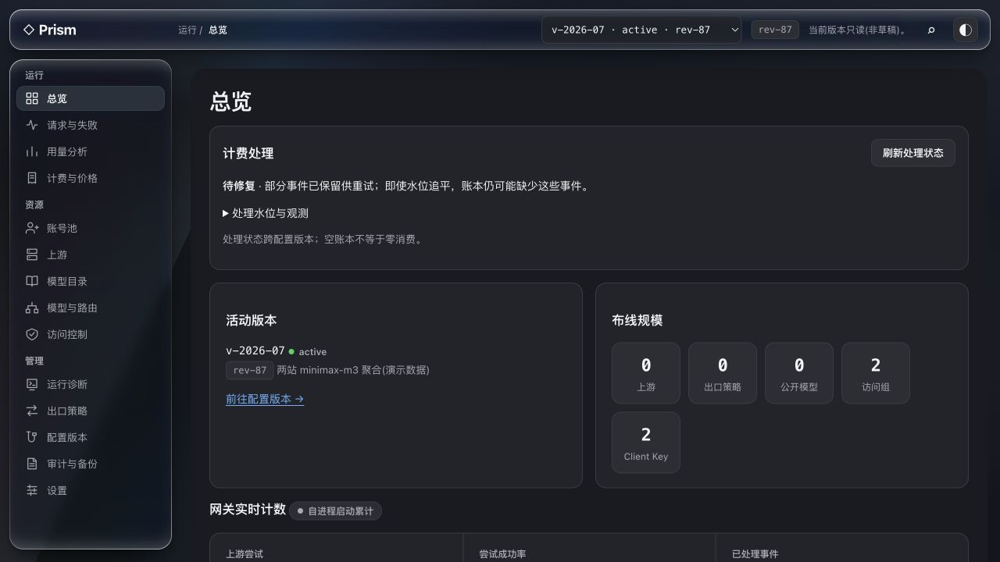
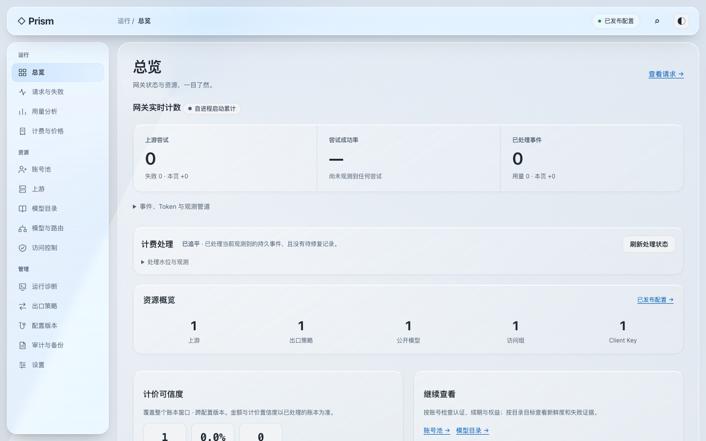
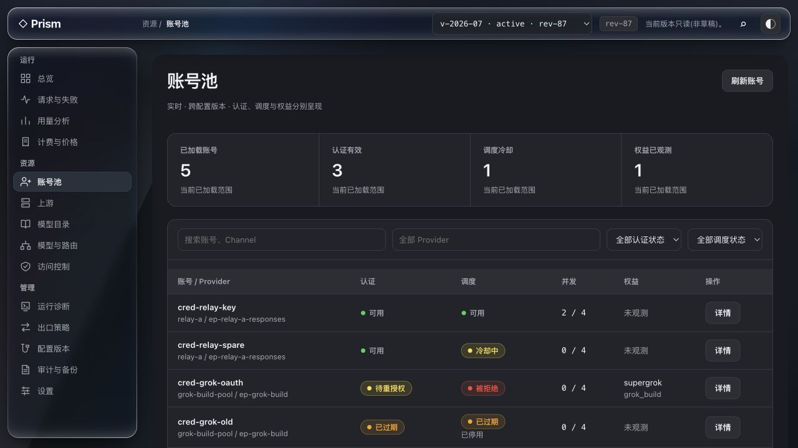
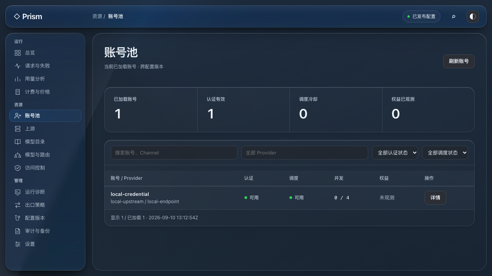
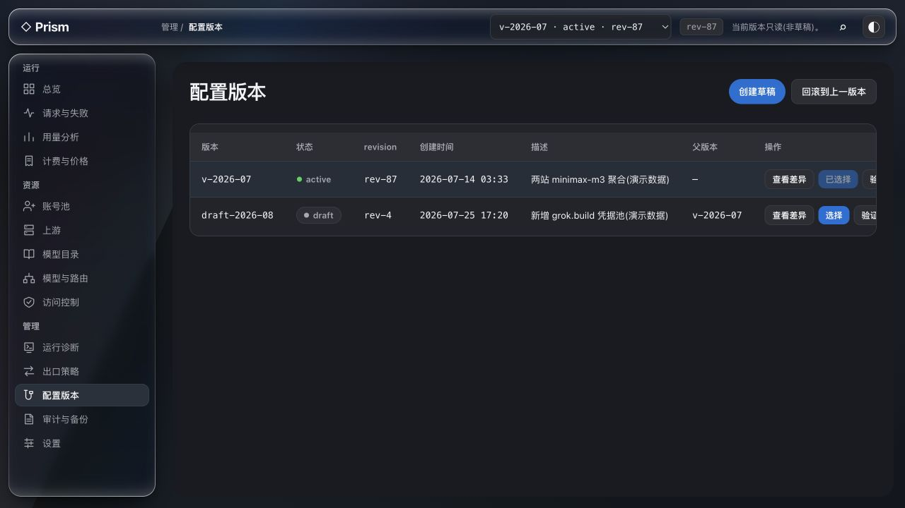
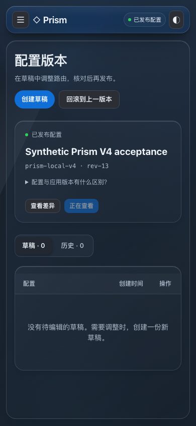
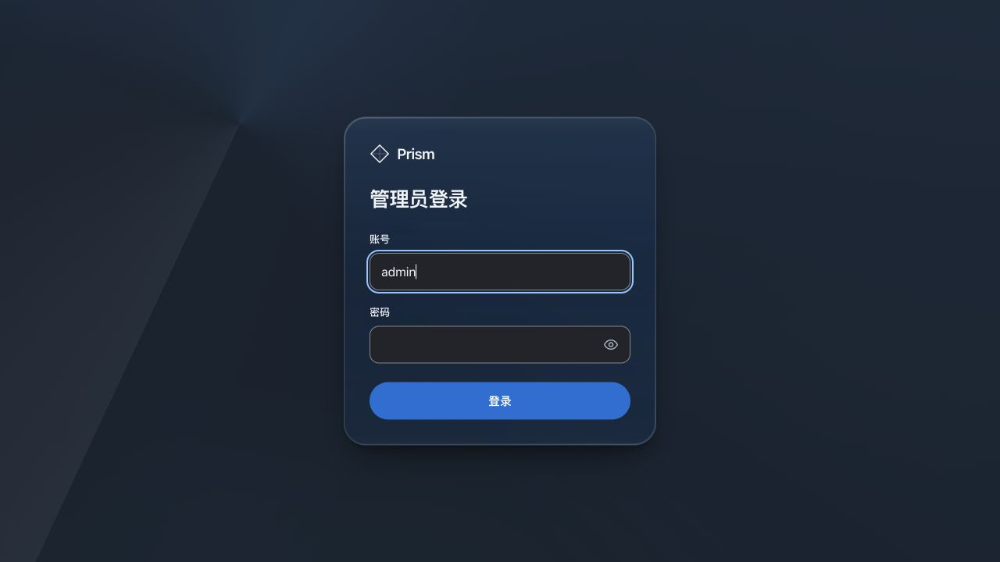

# Prism V5：统一玻璃材质与配置工作流

已更新到 [原域名 Prism](https://cpar.142857142.xyz/admin-ui/#/unlock)。运行代码为 `6489566b12f62a2d81767011a811ee5b7d9cf732`，刷新页面后使用原管理员账号密码重新登录。

本轮处理配置版本误解、明确测试草稿清理、正式 Prism 的整体视觉统一。
设计由本会话完成，通过 OpenDesign MCP 的既有项目
`prism-gateway-console-redesign-a735` 保存与回读，没有使用内置生成器或外部模型 CLI。

## 配置版本是什么

用户截图 `p12-chatgpt-go-test-1786163922 · rev-13` 是未发布的配置草稿。
切换它只改变管理界面查看／编辑的对象，不切换部署的程序，也不自动发布路由。
`rev-13` 是并发写保护用的配置修订号。

新版登录后默认选择已发布配置。顶栏仅显示查看状态，ID 与修订号留在配置管理中。
配置管理分为已发布卡片、草稿、历史；差异、来源、校验、发布和回滚功能都保留。
当前网关 `serve` 在重启时加载发布的配置，界面不把“已发布”冒充“运行快照已热更新”。

## 设计审查与改版

使用 Product Design audit 与 OpenDesign frontend-design skill。先捕获当前 React 应用的
三步流程，再在 OpenDesign 制作浅／深色交互样稿，最后移植到真实 React 组件和共享样式。
旧截图为本轮本地 fixture 数据；新截图来自本轮真实 gateway 与合成配置，均不是生产业务数据。

1. **总览：信息存在，但首屏优先级和材质割裂。** 旧版不透明大底板与强反光导航分离，
   计费说明和重复配置块压住指标。新版采用共享透光背景，优先显示真实累计指标，
   合并资源规模，把事件／Token／管道说明折叠。计费未完成状态继续显式展示。

   
   

2. **账号池：功能完整，重复说明和实底表格造成重感。** 新版统一透色面板、表头、输入框和细分隔线，
   统计口径只显示一次。认证、调度、权益保持独立，不把未观测当健康或零值。

   
   

3. **配置管理：操作可用，但全局下拉及七列表格容易误导。** 新版把已发布配置独立呈现，
   草稿／历史分组，三列表格保留所有操作，ID、revision、来源在管理场景内可查。
   手机宽表有独立横向滚动；对话框保留左右 12px、键盘和焦点返回。

   
   

材质实现：三面 chrome 的 `GlassSurface`／`PrismLens` 不变，增加一层共享 workspace 模糊。
内部面板只有透色、高光、边界和阴影，不逐卡开启模糊。增强对比、减少透明度和不支持能力时
恢复实底；表单、同源策略、内存会话、CSP 与四文件嵌入保持原边界。

[OpenDesign 交互稿](../design/prism-liquid-glass-v5.html) 回读逐字节一致，SHA-256：
`d14df640c686d168db475d0b8b4b6da4273708b9e50d7d6fe075e783ab4c6c91`。
样稿只代表视觉和三类工作流，不作为后端或 14 页功能完成的证据。

## 已执行的线上测试草稿清理

用户单独确认“保留历史请求和账本，只清理测试草稿”。实际清理范围：
10 个 `p12-chatgpt-go-test-*` 未发布草稿，以及 `prism-domain-check-c7cfd2c` 空验收草稿。
不是按名称批量删除所有包含 test 的记录。

- 每个目标核对 status、revision、无子版本、未参与发布／回滚、未被持久事件引用。
- 先建立私有 SQLite 备份并检查完整性，再以单事务删除 66 条目标资源记录。
- 原创建／修改审计不删除；配置行转为 archived，修订号递增，新增 11 条 `test_draft_retired` 审计。
  因此是“资源已清理、审计归档保留”，不是彻底抹除全部历史。
- 对所有非目标记录和既有审计做事务内摘要核对，并检查外键；结果保持不变。
  823 条请求、718 条尝试、676 条用量、589 条账本和 87 条历史待修复记录均保留。
- 当前活动配置及两个其他未确认用途的草稿保留。管理员认证库未访问或修改。

执行回执及具体 ID 清单位于本机 `output/prism-v5/cleanup-{manifest,dry-run,applied}.json`。
服务器私有备份：`/var/backups/cpa-rust-gateway/prism-v5-test-drafts-20260910/control-before.sqlite3`，
目录 0700、文件 0600。若恢复，应只从备份恢复这些目标版本和资源，并追加恢复审计；
不能直接覆盖整库而丢掉备份后新增的真实请求或用户修改。

可审查实现：[清理工具](../../scripts/prism-retire-test-drafts.py)、
[回归测试](../../scripts/test-prism-retire-test-drafts.py)。工具默认 dry-run，必须提供精确 ID／revision 清单；
只有提供新建的私有备份路径才执行，拒绝活动配置、已发布记录、子版本和事件引用。

## 本轮验证

| 范围 | 本轮证据 |
|---|---|
| 视觉与入口 | 真实 gateway 的 Chromium 151.0.7922.34，14 栏目 × 3 尺寸 × 浅深色，共 84 页视图，另有 6 个登录页 |
| 尺寸 | 1440×900、1280×720、390×844；独立表格滚动、右侧详情、手机边距、长 ID 与空态 |
| 前端单测 | 23 文件、259 用例通过，包含默认发布配置、无活动配置与晚到列表保护 |
| 前端 E2E | 全套首次 122/127 通过；5 项旧入口／默认未选择配置的断言已更新，相关 19 项重跑通过；其余通过项不重复计数 |
| 材质与辅助偏好 | 三面 chrome map、材质切换、Firefox/Safari 能力分支模拟、浅深色链接颜色、增强对比／减少透明度／减少动态、焦点恢复通过 |
| 契约与嵌入 | sync-contract 无变化，check、双构建一致、四文件门禁通过；Rust 嵌入资源、CSP 与 listener 边界 3 项通过 |
| 清理 | 4 个使用真实迁移构建的 SQLite 回归通过；线上 dry-run／私有备份／事务保护摘要／外键检查通过 |

本轮修正了旧测试对表格 active 行及顶栏下拉框的定位。调试期间两项测试因开发服务热更新
产生重复 ESM 实例，重启开发服务后通过；不把失败运行算作通过。
实际写入验收 `prism-v4-local-acceptance.py --priced --browser-flow --preview` 已通过：
真实模型授权交接、候选 CRUD、grant、校验／发布、重读／审计、版本差异、确认回滚、
移动辅助偏好及会话清理。Provider 为 loopback 合成服务，未调用真实 Provider。
本轮保留的本地预览为 `http://127.0.0.1:49728/admin-ui/#/`；合成管理员密码在对应
私有验收目录的 `admin-preview-password` 文件中，不是生产管理员密码。
原域名已使用本轮签名产物更新，正式门禁和线上回执见下文。

截图和自动检查不构成完整 WCAG 合规证明；本轮实际浏览器是 Chromium，
Safari／Firefox 仅覆盖能力回退分支，未宣称物理设备验收。

全部 14 栏目保留：总览、请求与失败、用量分析、计费与价格、账号池、上游、模型目录、
模型与路由、访问控制、运行诊断、出口策略、配置版本、审计与备份、设置，以及管理员登录／首次改密。

## 正式部署与回执

- [签名构建 34482022701](https://github.com/Ricardo121380/cpa-rust-gateway/actions/runs/34482022701)：ARM64、x86_64 均成功；本机独立验证 Cosign 身份、manifest、SBOM 和 receipt。
- [正式门禁 34482027298](https://github.com/Ricardo121380/cpa-rust-gateway/actions/runs/34482027298)：Fast、完整供应链、Required delivery gate 全部成功，均对应实现提交 `6489566`。
- VPS 临时隔离环境：新 ARM64 程序启动、账号初始化／首次改密／撤销／重启、真实草稿写读通过；四个嵌入资源与本地验收构建逐字节一致。
- 正式 CPAR 服务已切换；公网四个资源、CSP、匿名拒绝、原 CLI 鉴权读回、数据健康和 loopback listener 检查通过。
- 原管理员认证文件保留，没有读取生产密码或重设账号。已发布配置、2217 条持久事件、589 条账本、87 条历史修复记录、11 个清理审计均保留。
- Caddy、Origin 配置与其他服务保持不变；本轮没有主动发起真实 Provider 推理测试。

第一次切换因发布脚本沿用了私有备份的 umask，新程序目录成为 0700，systemd 报
`203/EXEC Permission denied`，期间服务短暂中断并自动回滚到 `b30d191`。
修复为发布目录／程序 0755，备份继续 0700／0600，并增加实际服务用户且移除额外 capabilities 的执行预检。
第二次切换通过，停止到恢复健康 **1227 ms**；该耗时只代表成功的第二次切换，不包含首次失败。
没有通过数据库恢复回滚，也没有放宽 systemd 服务权限。

运行二进制 SHA-256：
`5f5a303b6ecf4dacf31c9e4fc67dfa3e0c1cfdb261c05aa2bf08df7bbc9a2d0e`。

| 公网资源 | SHA-256 |
|---|---|
| `/admin-ui/` | `1121e8b70f28997fd2684e757f40e862b036e0318144d75834ef18418ea7bc19` |
| `/admin-ui/assets/main.js` | `6a0bdfa7430ec4da1b525a6e681831237b51a0d5dbacc82c2424a4bea23b0f60` |
| `/admin-ui/assets/vendor.js` | `6b6ea2186c7d05e7e13e63310ea22f96e1fa0e9733a81c6436747f373199ac8f` |
| `/admin-ui/assets/index.css` | `708f7d6aa703270acec29eb0d2cdab42196fee90b6e251e5c2e39f2db446a44f` |

实际内置浏览器已打开公网登录页，未代替用户输入生产密码。

回滚目标：`b30d191cd61bc974dc29cc8e56433542fdb268b8`。只回切程序，不降级 schema 22 或覆盖认证／控制数据库。
VPS 操作、隔离验收及私有备份位于 `/var/backups/cpa-rust-gateway/prism-v5-deploy-20260910`；
本机可审查的执行脚本、签名核验日志和线上回执位于 `output/prism-v5/`。
两次操作的回执均保留，最终状态以 `production-receipt.json` 为准。
