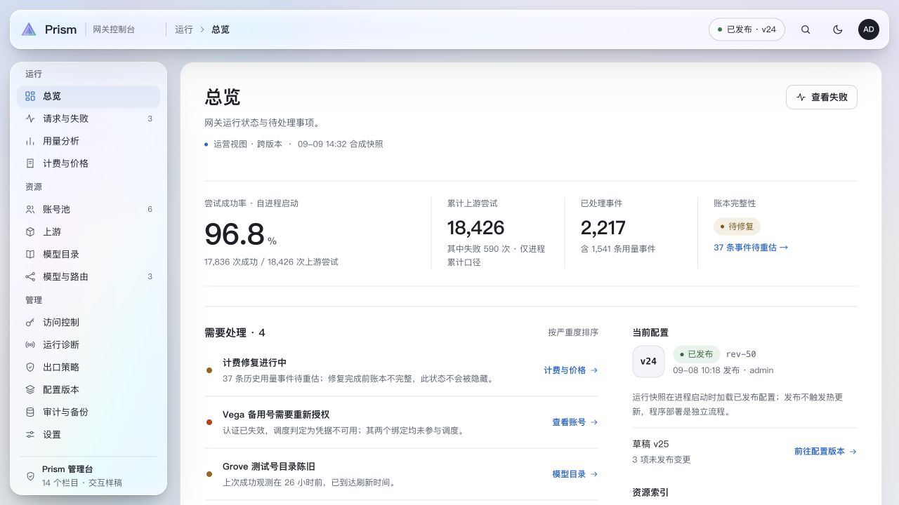
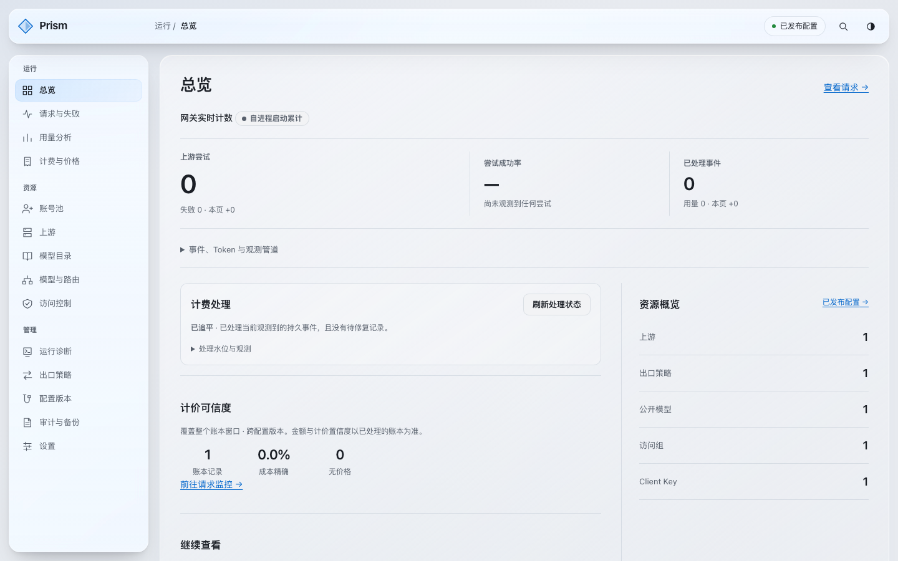
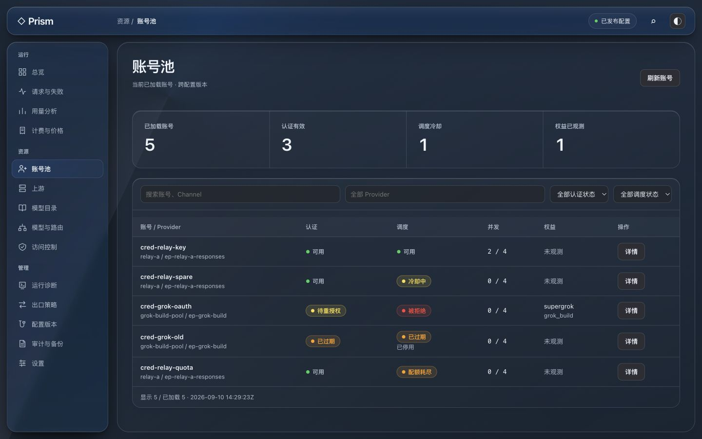
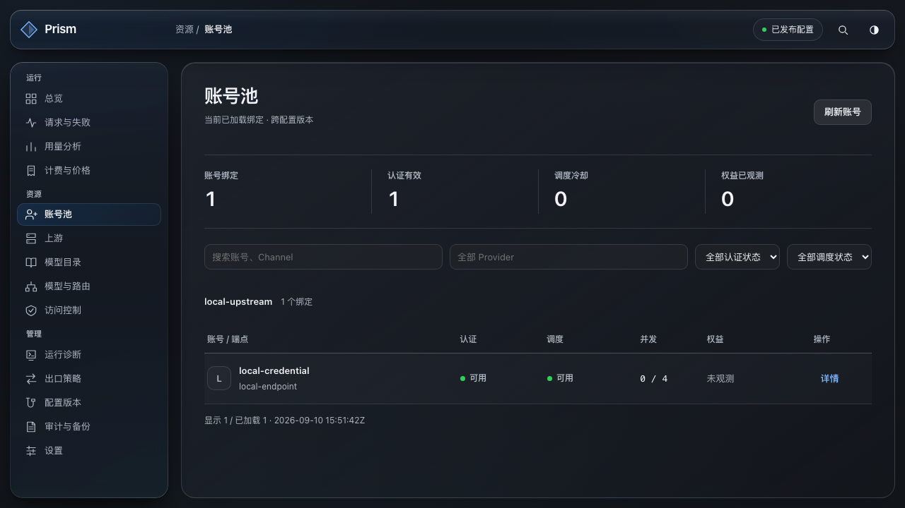
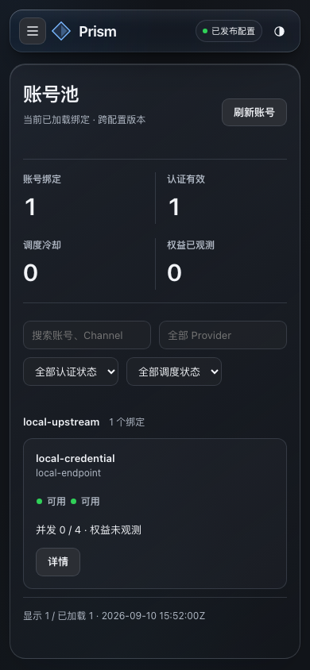
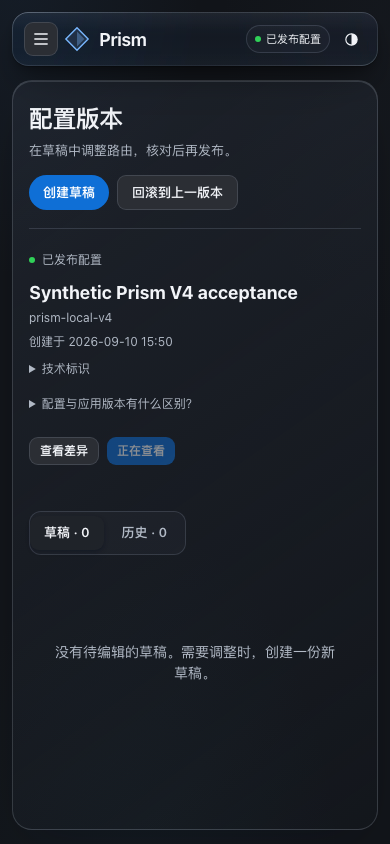

# Prism V6：K3 max 设计与生产资源名称

**本地最终验收通过，正式发布尚在准备。** 名称修正提交为 `c839321`；本报告会在签名构建、隔离验收及原 CPAR 服务更新后补齐正式回执。

## 本轮改变

- 用业务名称或可读名称替代列表中的 P12 阶段前缀、测试时间戳和长哈希，以短编号区分同名对象。完整 ID 在技术详情和复制中保留，API 参数、模型 exact ID、路由和审计引用保持原值。
- 总览改为分层指标和运营／资源索引分栏；计费修复状态醒目，口径说明按需展开。
- 账号池按上游分组，减少逐行重复信息；同一账号的不同绑定仍分别展示，计数明确为绑定。
- 顶栏、侧栏、内容层统一为银白／石墨的磨砂质感；内部使用细分隔线，减少层叠边框。保留三面 chrome 和共享工作区模糊，行与小组件没有额外模糊。
- 配置 ID、revision、来源集中到一个技术详情区；手机配置列表纵向排列。原有草稿、差异、校验、发布、回滚和确认流程保留。

本次不清理历史请求、账本或认证数据；之前确认的 11 个测试草稿清理结果保留。没有改写稳定资源 ID，也没有通过隐藏记录解决命名问题。

## 确实使用的设计模型

通过 OpenDesign MCP 既有项目 `prism-gateway-console-redesign-a735`，调用 Pi 的
`cc-switch-kimi-for-coding/k3:max`，使用 `frontend-design` skill。该路由是用户在原 OpenCode Go
额度耗尽后明确选择的 Kimi for Coding K3；`max` 通过 Pi 的实际模型参数解析生效。

运行 `101cbe62-d3f6-425b-b171-ecacb2e37285` 已结束。K3 的原型和规格经 MCP 读取，Codex
修正了原型的一处表格拼接类型错误，再保存回读，并在内置浏览器检查全部 14 个入口。
[来源与哈希](../design/prism-v6-provenance.json)、[可运行原型](../design/prism-liquid-glass-v6.html)、
[生产适配说明](../handoffs/prism-opendesign-v6.md)记录了完整来源及适配边界。

正式实现采用 K3 的分节与布局，并延续用户要求的统一通透材质。模型原稿中的合成待办、
固定授权、账号合并和一对一模型路由关系没有迁入真实 API 或生产默认数据。

## 全部入口

以下为本次正式嵌入式 React 应用的真实 gateway 检查，不是独立 HTML 或 mock API 的替代证明。
每个管理入口均在 1440×900、1280×720、390×844 下检查浅／深色，共 84 个页面视图，
另有 6 个登录页视图；[逐页记录](../design/prism-v6-evidence/browser-audit.json)保留标题、路由、
尺寸、错误及溢出检查结果。

| 栏目 | 正式路由 | 本轮落点 |
|---|---|---|
| 总览 | `#/` | 分层指标、计费状态、资源索引分栏 |
| 请求与失败 | `#/monitoring` | 统一表格与来源名称、保留筛选／尝试／诊断深链 |
| 用量分析 | `#/usage` | 统一数据面与分组名称、六类 token 置信度保留 |
| 计费与价格 | `#/billing` | 价格引用名称、真实处理状态与异常 |
| 账号池 | `#/accounts` | 上游分组、绑定独立行、短编号与技术详情 |
| 上游 | `#/upstreams` | 业务名称、子资源与凭据引用 |
| 模型目录 | `#/catalog` | 目标名称与有效模型上下文 |
| 模型与路由 | `#/models` | 原模型 exact ID、完整资源枚举与工作台 |
| 访问控制 | `#/access` | 组名称与原始授权值 |
| 运行诊断 | `#/runtime` | 目标名称、账号、候选与 Explain 引用 |
| 出口策略 | `#/egress` | 策略、代理池、节点与绑定名称 |
| 配置版本 | `#/versions` | 技术信息折叠、手机纵向布局、完整生命周期操作 |
| 审计与备份 | `#/audit` | 资源引用可读，原始事实可查 |
| 设置 | `#/settings` | 统一控件、原外观／辅助／会话功能 |
| 管理员登录 | `#/unlock` | 简洁账号密码表单、真实会话及首次改密 |

## 本次验证

- 前端类型检查、**262 项单测**、**128 项完整 E2E**通过。
- `node scripts/check-management-spa.mjs` 通过：**111 个权威操作**、生成客户端无漂移、
  CSP 与四文件双构建一致。构建仍为 `index.html`、`assets/main.js`、`assets/vendor.js`、`assets/index.css`。
- **3 项 Rust 嵌入测试**通过，包含精确资源、加固响应头和管理／数据面路由隔离。
- `scripts/prism-v4-local-acceptance.py --priced --browser --browser-flow --preview` 通过，
  使用临时合成状态、真实 `gateway serve` 和 TLS loopback mock Provider。
- 真实浏览器 **10 阶段操作**通过：授权模型→草稿→候选 CRUD→授权→校验／发布→重读与审计；
  账号动作、失败→attempt→target／Explain、配置差异、生命周期旧确认拒绝、会话清理均在链路中。
- 实际请求经过数据 listener、持久事件、计费物化和账本；重启 checkpoint 幂等、既有 TTL 维护也通过。
- 内置浏览器另核对手机账号详情：宽 366px、左右各 12px，Esc 后焦点返回触发按钮。
- 实测 Chromium **151.0.7922.34**。Safari／Firefox 仍仅有已有能力回退分支测试，不宣称实体浏览器验收。

一次早期完整 E2E 中，标签切换尚未完成时测试填写了即将卸载的旧表单。
增加“失败归因标签已选中”的界面检查后，9 项监控用例和最终全部 128 项 E2E 通过。
原型的表格错误同样记录并修复，没有把失败结果计入通过证据。

原始日志位于 `output/prism-v6/`：`v6-final-unit.log`、`v6-final-e2e.log`、
`v6-final-spa-gate.log`、`v6-final-rust.log`、`v6-final-real-gateway.log`。
当前可查看[本地真实应用](http://127.0.0.1:57092/admin-ui/#/)；这是合成验收环境，
与生产管理员账号无关。临时状态和仅本人可读的预览凭据保存在该次验收目录。

## 正式发布

待签名构建、精确提交门禁、隔离 ARM64 验收及原 CPAR 服务更新后填写回执。

请求趋势／延迟分析、完整英文、生产真实 Provider 自动巡检、在线备份恢复等仍按原范围留待后续。
